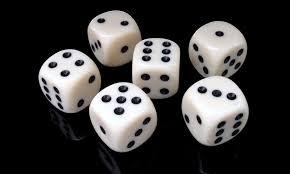

# Bibliotecas básicas

Python oferece **inúmeras** bibliotecas para facilitar o desenvolvimento de programas, neste módulo vamos estudar algumas das mais **básicas** e úteis.


---
# Importação de bibliotecas

Uma biblioteca é um conjunto de funções e métodos que podem ser utilizados em um programa. Para utilizar uma biblioteca, é necessário importá-la. 

- `import` é o comando utilizado para **importar** uma biblioteca por **completo**.

```python
import math

print(math.sqrt(25)) 
>>> 5.0
```

- Podemos acessar as funções da biblioteca utilizando o nome da biblioteca seguido de um ponto e o nome da função.

---

Podemos importar apenas uma função específica de uma biblioteca, utilizando o comando `from`:

```python
from math import sqrt

print(sqrt(25))
>>> 5.0
```

- Nestes casos, não é necessário utilizar o nome da biblioteca para chamar a função.
- Podemos importar **múltiplas** funções de uma vez, separando-as por vírgula.
- Podemos importar **todas** as funções de uma biblioteca utilizando o caractere `*`. Não é recomendado, pois pode **sobrescrever** funções já existentes. 

---

Podemos **renomear** uma biblioteca ou função importada utilizando o comando `as`:

```python
import math as m

print(m.sqrt(25))
>>> 5.0
```
ou
```python
from math import lcm as mmc

print(mmc(12, 15))
>>> 60
```

- Este recurso é útil para bibliotecas com **nomes longos**.

---


# Bibliotecas básicas

## `math`

Oferece **funções** e **constantes** matemáticas [doc](https://docs.python.org/3/library/math.html)


---

### Constantes:

```python
import math
print(math.pi) # 3.141592653589793
print(math.tau) # 6.283185307179586 (2*pi)
print(math.e)  # 2.718281828459045 (número de Euler)
print(math.inf) # infinito positivo
print(math.nan) # Not a Number (NaN)
```

---

#### `NaN` (Not a Number)

- `NaN` é um valor especial que representa um resultado **inválido** ou **indefinido**.
- `NaN` é diferente de qualquer valor, inclusive de si mesmo. Por isso, não podemos compará-lo com `==` ou `!=` diretamente.
- Para verificar se um valor é `NaN`, utilizamos a função `math.isnan`.

```python
def media(numeros):
    if len(numeros) == 0: # lista vazia não tem média
        return math.nan
    return sum(numeros) / len(numeros)

m = media([])
if math.isnan(m):
    print('Não é possível calcular a média de uma lista vazia.')
else:
    print(m)    
```

---

#### `inf` (infinito)

- `inf` é um valor especial que representa um número **infinitamente grande**.
- `inf` é um valor **real**, mas não é um número **finito**.
- `inf` é utilizado para representar **divisões por zero** e inicializar variáveis com **valores extremos**.

```python
print(math.inf > 1000) # True
print(math.inf + 1) # inf
print(math.inf - math.inf) # nan
print(math.inf / 2) # inf
print(math.inf / math.inf) # nan
```


---

### Matemática finita:

```python
print(math.comb(5, 2)) # 10 (combinação de 5 elementos tomados 2 a 2)
print(math.perm(5, 2)) # 20 (permutação/arranjo de 5 elementos tomados 2 a 2) 
print(math.factorial(5)) # 120 (fatorial de 5)
print(math.gcd(12, 15)) # 3 (MDC de 12 e 15)
print(math.lcm(12, 15)) # 60 (MMC de 12 e 15)
```

---

### Manipulação de números reais:

```python
print(math.ceil(3.14)) # 4 (arredonda para cima)
print(math.floor(3.14)) # 3 (arredonda para baixo)
print(math.trunc(3.14)) # 3 (trunca a parte decimal)
print(math.fabs(-3.14)) # 3.14 (valor absoluto/módulo)
```
- A diferença entre `floor` e `trunc` aparece quando o número é **negativo**.

- `round` é uma função **embutida** que arredonda para o inteiro mais próximo, não é necessário importar a biblioteca `math`.

---

### Verificação de números reais:

```python
print(math.isfinite(3.14)) # True (é um número finito)
print(math.isinf(math.inf)) # True (é infinito)
print(math.isnan(math.nan)) # True (não é um número)
print(math.isclose(3.14, 3.14159)) # False (não são próximos)
``` 

A função `isclose` é bastante útil para comparar números reais, pois quando comparamos valores de ponto flutuante oriundos de **cálculos matemáticos** diferentes, é comum que haja uma **pequena diferença** entre eles.

---

### Outras funções matemáticas:

- Funções trigonométricas: `sin`, `cos`, `tan`, `asin`, `acos`, `atan`, `atan2`, `hypot`, `degrees`, `radians`

- Funções hiperbólicas: `sinh`, `cosh`, `tanh`, `asinh`, `acosh`, `atanh`
- Funções exponenciais e logarítmicas: `exp`, `expm1`, `log`, `log1p`, `log2`, `log10`, `pow`, `sqrt`

- Funções especiais: `erf`, `erfc`, `gamma`, `lgamma`, `beta`


---

### Exercícios de fixação

1. Calcule o valor de $\sqrt{2}$ utilizando a função `sqrt` da biblioteca `math`.
2. Calcule o valor de $\sin(\pi/4)$ utilizando a função `sin` da bibli library `math`.
3. Leia duas coordenadas no formato **latitude** e **longitude** e calcule a distância entre elas utilizando a formula de [Haversine](https://en.wikipedia.org/wiki/Haversine_formula).
4. Calcule o n-ésimo termo da sequência de Fibonacci utilizando a  fórmula de Binet: $F(n) = \frac{\phi^n - \psi^n}{\sqrt{5}}$, onde $\phi = \frac{1 + \sqrt{5}}{2}$ e $\psi = \frac{1 - \sqrt{5}}{2}$.
5. De quantos modos diferentes podemos escolher 3 pratos em um cardápio de 10 pratos?
6. Qual é o MDC de 12 e 15?

---

## `random`

Oferece funções para geração de números **aleatórios** [doc](https://docs.python.org/3/library/random.html)



---

### Números aleatórios

- Um computador comum é uma máquina **determinística**, ou seja, dada uma **entrada**, sempre produzirá a mesma **saída**.
- Para gerar números aleatórios, utilizamos algoritmos que produzem sequências de números que **parecem** ser aleatórios.
- Chamamos esses números de **pseudo-aleatórios**.
- A biblioteca `random` oferece funções para gerar números **pseudo-aleatórios**.

---

- `random()`: gera um número real aleatório no intervalo $[0, 1)$.

```python
import random
print(random.random())
```

- `randint(a, b)`: gera um número inteiro aleatório no intervalo $[a, b]$.

```python
print(random.randint(1, 6)) # simula um dado de 6 faces
```

---

- `choice(seq)`: escolhe um elemento aleatório de uma sequência.

```python
cantores = ['Elvis', 'Michael', 'Madonna', 'Beyoncé']
print(random.choice(cantores))
```

- `shuffle(seq)`: embaralha uma sequência.

```python
baralho = ['A', '2', '3', '4', '5', '6', '7', '8', '9', '10', 'J', 'Q', 'K']
random.shuffle(baralho)
print(baralho)
```

---

- `sample(seq, k)`: escolhe $k$ elementos aleatórios de uma sequência sem repetição.

```python
print(random.sample(baralho, 5))
```

- `choices(seq, k)`: escolhe $k$ elementos aleatórios de uma sequência com repetição.

```python
print(random.choices(baralho, k=5))
```

- È possível atribuir **pesos** para cada elemento da sequência. Ex.: *David* tem 4 vezes mais chances de ser sorteado que *Alice*.

```python
participantes = ['Alice', 'Bob', 'Charlie', 'David']
pontos_na_rifa = [1, 2, 3, 4]
print(random.choices(participantes, weights=pontos_na_rifa, k=2))
```

---

- `gauss(mu, sigma)`: gera um número aleatório seguindo uma distribuição normal com média $\mu$ e desvio padrão $\sigma$.

```python
print(random.gauss(0, 1))
```

- Há outras funções para gerar números aleatórios seguindo outras distribuições, como `uniform`, `expovariate`, `gammavariate`, `betavariate`, `paretovariate`, `weibullvariate`.

---

### Semente aleatória

Os números pseudo-aleatórios seguem uma sequência determinada por uma **semente**.

- Python gera automaticamente uma semente aleatória a partir do **relógio do sistema**.
- Podemos definir uma semente **manualmente** utilizando a função `seed`.

```python
random.seed(42)
for _ in range(5):
    print(random.random())
```

- Se definirmos a **mesma** semente, a **sequência** gerada será a mesma.
- Isso é útil para **reproduzir** resultados durante o **desenvolvimento** e **testes**.

---

### Aplicações

- **Simulações** de eventos aleatórios.
- **Embaralhamento** de sequências.
- **Algoritmos de otimização** baseados em busca aleatória.
- **Criptografia** e **segurança** de dados.
- **Jogos** e **entretenimento**.
 
---

### Exercícios de fixação

1. Simule o lançamento de um dado de 6 faces 1000 vezes e conte a frequência de cada face.
2. Embaralhe um baralho de 52 cartas e distribua 5 cartas para 4 jogadores.
3. Escolha 6 números da Mega-Sena.
4. Simule o lançamento de uma moeda 1000 vezes e conte a frequência de cara e coroa.
5. Simule o lançamento de um dado viciado, onde a face 6 tem o dobro de chance de sair que as outras faces.
6. Crie um jogo de adivinhação onde o computador escolhe um número aleatório e o jogador deve adivinhar qual é. O computador deve dar dicas se o número é maior ou menor que o palpite do jogador.Quando o jogador acertar, o computador deve informar quantas tentativas foram necessárias.

---

## `statistics`

Oferece funções para cálculos estatísticos [doc](https://docs.python.org/3/library/statistics.html)


---

### Estatísticas descritivas

- `mean(data)`: calcula a média aritmética dos elementos de `data`.

```python
import statistics
print(statistics.mean([1, 2, 3, 4, 5]))
```

- `median(data)`: calcula a mediana dos elementos de `data`.

```python
print(statistics.median([1, 2, 3, 4, 5]))
```
- `stdev(data)`: calcula o desvio padrão dos elementos de `data`.

```python
print(statistics.stdev([1, 2, 3, 4, 5]))
```

---

- `fmean(data,pesos)`: calcula a média aritmética **ponderada** dos elementos de `data` com pesos `pesos`.

```python
print(statistics.fmean([1, 2, 3, 4, 5], [1, 2, 3, 4, 5]))
```

- `mode(data)`: calcula a moda dos elementos de `data`.

```python
print(statistics.mode([1, 2, 2, 3, 3, 3, 4, 4, 4, 4, 5]))
```

- `multimode(data)`: calcula as modas dos elementos de `data`.

```python
print(statistics.multimode([1, 2, 2, 3, 3, 3, 4, 4, 4, 4, 5]))
```


---

- `variance(data)`: calcula a variância dos elementos de `data`.

```python
print(statistics.variance([1, 2, 3, 4, 5]))
```

- `harmonic_mean(data)`: calcula a média harmônica dos elementos de `data`.

```python
print(statistics.harmonic_mean([1, 2, 3, 4, 5]))
```
- `geometric_mean(data)`: calcula a média geométrica dos elementos de `data`.

```python
print(statistics.geometric_mean([1, 2, 3, 4, 5]))
```

---


- `quantiles(data, n)`: calcula os quantis de `data`.

```python
print(statistics.quantiles([1, 2, 3, 4, 5], n=4))
```

- Outros métodos na [documentação](https://docs.python.org/3/library/statistics.html#module-statistics).

---

## Exercícios de fixação

1. Calcule a média, mediana, moda, variância e desvio padrão dos seguintes dados: [1, 2, 3, 4, 5, 6, 7, 8, 9, 10].
2. Calcule a média harmônica e geométrica dos seguintes dados: [1, 2, 3, 4, 5].
3. Calcule os quartis dos seguintes dados: [1, 2, 3, 4, 5, 6, 7, 8, 9, 10].
4. Calcule a média aritmética ponderada dos seguintes dados: [1, 2, 3, 4, 5] com pesos [1, 2, 3, 4, 5].


---

# Conclusão

- Python oferece inúmerjsonas bibliotecas para facilitar o desenvolvimento de programas.
- As bibliotecas `math`, `random` e `statistics` são bastante úteis para cálculos matemáticos e estatísticos.
- Para os estatísticos, podem, ainda, citar:
  - `numpy` e `scipy` para cálculos numéricos e científicos.
  - `pandas` para manipulação de dados.
  - `matplotlib` e `seaborn` para visualização de dados.
  - `scikit-learn` para aprendizado de máquina.
  - `statsmodels` para modelagem estatística.
  - `tensorflow` e `pytorch` para aprendizado profundo.


