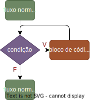
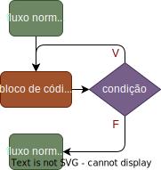

# Introdução à Linguagem C

Neste módulo, vamos aprender os conceitos **básicos** da linguagem de programação *C*, sob a perspectiva de um programador iniciante Python.


---

## O que é C?

- Linguagem de programação de **propósito geral** e **estruturada**
- Desenvolvida por **Dennis Ritchie** em **1972**
- Base para diversas outras linguagens (*c-like*): C++, C#, Objective-C, Java, JavaScript, PHP, Python, Ruby, Swift, etc.
- Muito utilizada em **sistemas operacionais** (Unix, Linux, Windows), ***drivers*** de dispositivos, jogos, **sistemas embarcados**, etc.
- Linguagem de médio nível (permite manipulação de *hardware*)

---

# Compilação

Ao contrário de linguagens **interpretadas**, como Python, C é uma linguagem **compilada**. Isso significa que o código fonte é traduzido para código de máquina antes de ser executado.

- **Código fonte**: código escrito pelo programador em um arquivo de texto (extensão `.c`)
- **Código objeto**: código de máquina gerado pelo compilador (extensão `.exe` no Windows)
- **Compilador**: programa que traduz o código fonte para código objeto
- **Linker**: programa que junta o código objeto com bibliotecas externas para gerar o executável

---

# Comparação entre Python e C

## Compilado vs Interpretado

- **Python**: código é executado linha a linha, sem necessidade de compilação
- **C**: código é traduzido para código de máquina antes de ser executado
- **Vantagens de C**: execução **muito mais rápida**, controle total sobre o *hardware*
- **Desvantagens de C**: menor produtividade, menor flexibilidade na sintaxe

---

## Tipos estáticos vs dinâmicos

- **Python**: tipos das variáveis são inferidos em tempo de execução
- **C**: tipos das variáveis são definidos em tempo de compilação
- **Vantagens de C**: maior eficiência, menor uso de memória
- **Desvantagens de C**: menor produtividade, código mais complexo

---

## Sintaxe 

- **Python**: Muito flexível, muitas formas de se fazer a mesma coisa, muitas bibliotecas, muitas funções embutidas, muitas palavras-chave
- **C**: Sintaxe mais rígida, menos funções embutidas, menos palavras-chave, menos bibliotecas
- **Vantagens de C**: código mais enxuto, menos ambiguidades, curva de aprendizado mais curta. Dificilmente um programador médio vai se deparar com um código C com sintaxe não familiar.
- **Desvantagens de C**: menor flexibilidade, menos recursos embutidos.

---

## Conclusão

- **Python**: linguagem de alto nível, fácil de aprender, produtividade alta, execução lenta
- **C**: linguagem de médio nível, mais difícil de aprender, produtividade baixa, execução rápida
- **Quando usar C**: aplicações de baixo nível, sistemas operacionais, drivers de dispositivos, aplicações que precisam de alta performance e controle total sobre o hardware (jogos, sistemas embarcados, etc.)
- **Quando usar Python**: aplicações de alto nível, prototipagem, aplicações web, ciência de dados, automação, etc.

---

# Estrutura de um programa C

```c
#include <stdio.h>
int main(){
    printf("Hello, World!");
    return 0;
}
```

- **`#include <stdio.h>`**: inclui a biblioteca padrão de entrada e saída
- **`int main()`**: função principal do programa
- **`printf("Hello, World!");`**: função que imprime uma mensagem na tela
- **`return 0;`**: retorna 0 para o sistema operacional
- **`{}`**: delimitam um bloco de código
- **`;`**: indica o fim de uma instrução
  

---

# Função `main`

- **`int main()`**: função principal do programa.
- *C* começa a execução pela função `main`.
- `int` indica que a função retorna um valor inteiro.
- `()` indica que a função não recebe argumentos.
- `return 0;` indica que o programa terminou com sucesso.
- `{}` delimitam o bloco de código da função.


---

# Compilando um programa C

Para compilar um programa C, você precisa de um compilador. O compilador mais comum é o `gcc` (GNU Compiler Collection).

Para compilar o programa `hello.c`:

```bash
gcc hello.c -o hello
```

Isso vai gerar um arquivo executável chamado `hello`. Para executar o programa:

```bash
./hello
```

> Neste curso usaremos o ambiente online [onlinegdb](https://www.onlinegdb.com/) para compilar e executar programas C de forma didática.

---

# Blocos de código

- *C* não se importa com a indentação do código.
- Blocos de código são delimitados por chaves `{}` quando possuem mais de uma linha.
- Bloco de código de uma única linha não precisa de chaves.
- Comandos são separados por ponto e vírgula `;`.
- Um programa *C* pode ser escrito em uma única linha.

```c
#include <stdio.h>
int main(){printf("Hello, World!");return 0;}
```

---

# Comentários

- Comentários são trechos de texto ignorados pelo compilador.
- São usados para documentar o código.
- Em *C*, comentários de uma linha são feitos com `//`.
- Comentários de múltiplas linhas são feitos com `/*` e `*/`.

```c
#include <stdio.h>
/* Este é um comentário 
de múltiplas linhas */
int main(){
    // Imprime "Hello, World!"
    printf("Hello, World!");
    return 0;
}
```

---
# Entrada e saída de dados

- *C* possui funções específicas para entrada e saída de dados.
- A função `printf` é usada para imprimir dados na tela.
- A função `scanf` é usada para ler dados do teclado.

---

## Função `printf`

Em Python:

```python
print("Hello, World!")
```

Em C:

```c
printf("Hello, World!");
```

---
### Imprimindo variáveis:


```python
# Python:
x = 10
print(f"O valor de x é {x}")
```


```c
// C:
int x = 10;
printf("O valor de x é %d", x);
```

- `%d`: substitui o valor de `x` na *string* usando o formato inteiro.
- As variáveis são passadas como argumentos após a *string*.
- Se o formato usado não corresponder ao tipo da variável, o resultado será imprevisível.

---

### Conversão de tipos

| Tipo     | Formato |
| -------- | ------- |
| `int`    | `%d`    |
| `float`  | `%f`    |
| `double` | `%lf`   |
| `char`   | `%c`    |
| `string` | `%s`    |

---

## Função `scanf`


```python
# Python:
x = int(input("Digite um número: "))
```


```c
// C:
int x;
printf("Digite um número: ");
scanf("%d", &x);
```

- `scanf` **não** imprime uma mensagem na tela. É necessário usar `printf` para isso.
- `&x` é o endereço de memória da variável `x`. 
- `%d` é o formato inteiro. 
- Se for passado um tipo diferente do esperado, o resultado será imprevisível.

---

# Variáveis

- Variáveis são espaços de memória que armazenam valores.
- Em *C*, as variáveis precisam ser declaradas antes de serem usadas.
- A declaração de variáveis segue o padrão `tipo nome;`.
- Tipos de variáveis em *C*: `int`, `float`, `double`, `char`, `bool`, etc.

```c
    int x; // Declaração de uma variável inteira
    int a,b,c; // Declaração de múltiplas variáveis inteiras
    int d = 10; // Declaração e inicialização de uma variável inteira
    int e = 10, f = 20; // Declaração e inicialização de múltiplas variáveis inteiras    
```

> Quando um variável é declarada sem ser inicializada, ela contém um valor indefinido (lixo de memória).


---

# Tipos de variáveis

| Tipo     | Tamanho | *range*                                                | literal | conversão |
| -------- | ------- | ------------------------------------------------------ | ------- | --------- |
| `char`   | 1 byte  | -128 a 127                                             | `'a'`   | `%c`      |
| `short`  | 2 bytes | -32.768 a 32.767                                       | `10`    | `%hd`     |
| `int`    | 4 bytes | -2.147.483.648 a 2.147.483.647                         | `10`    | `%d`      |
| `long`   | 8 bytes | -9.223.372.036.854.775.808 a 9.223.372.036.854.775.807 | `10`    | `%ld`     |
| `float`  | 4 bytes | 1.2E-38 a 3.4E+38                                      | `10.5`  | `%f`      |
| `double` | 8 bytes | 2.3E-308 a 1.7E+308                                    | `10.5`  | `%lf`     |

---

# Modificador `unsigned`

- **`unsigned`**: não permite valores negativos

```c
    unsigned int x; // Variável inteira sem sinal (0 a 4.294.967.295)
```

---

Na prática, você vai usar principalmente os tipos `int`, `double` e `char`. Os outros tipos são usados em situações específicas.

---

# Operadores aritméticos

- *C* suporta os operadores aritméticos básicos: `+`, `-`, `*`, `/`, `%`.
- *C* não suporta operações com números complexos, matrizes, vetores, etc.
- *C* não possui operadores de potenciação e radiciação.

```c
int a = 10, b = 20;
int c = a + b; // Soma
int d = a - b; // Subtração
int e = a * b; // Multiplicação
int f = a / b; // Divisão
int g = a % b; // Resto da divisão
```

---

## Divisão inteira

- Ao contrário de Python, *C* **não** possui um operador específico para divisão **inteira** (`//`).
- O tipo de divisão é determinado pelo tipo das variáveis ou literais  envolvidas.
- Se ambos os operandos são inteiros, a divisão é inteira.
- Se pelo menos um dos operandos é `float` ou `double`, a divisão é de ponto flutuante.

```c
int a = 10, b = 3;
int c = a / b; // c = 3
```

```c
float x = 10, y = 3;
float z = x / y; // z = 3.333333
```

---

# Operadores de incremento e decremento

- *C* suporta os operadores de incremento `++` e decremento `--`.
- O operador de incremento `++` adiciona 1 à variável.
- O operador de decremento `--` subtrai 1 da variável.

```c
int a = 10;
a++; // a = a + 1 
a--; // a = a - 1
```

---

## Prefixo vs Sufixo

- O incremento e decremento podem ser do tipo **prefixo** (`++a`) ou **sufixo** (`a++`)
- No caso do **prefixo**, a variável é incrementada antes de ser usada.
- No caso do **sufixo**, a variável é incrementada depois de ser usada.

```c
// Aqui não há diferença, pois o valor de 'a' não é usado na expressão
int a = 10;
a++; // a = a + 1
++a; // a = a + 1
```

```c
int a = 10,b, c;
b = a++; // b = a; a = a + 1; primeiro c recebe o valor de a e depois a é incrementado
c = ++a; // a = a + 1; c = a; primeiro b é incrementado e depois d recebe o valor de b
```

---

# Atribuição com **acumulação**

Mesmo que em Python, *C* suporta operadores de atribuição com acumulação `+=`, `-=`, `*=`, `/=`, `%=`.

```c
int a = 10;
a += 5; // a = a + 5
a -= 5; // a = a - 5
a *= 5; // a = a * 5
a /= 5; // a = a / 5
a %= 5; // a = a % 5 
```

---

# Operadores de **Comparação**

- *C* suporta os operadores de comparação `==`, `!=`, `>`, `<`, `>=`, `<=`.
- Os operadores de comparação retornam um valor inteiro (`0` para falso e `1` para verdadeiro).

```c
int a = 10, b = 20;
if (a == b) printf("a é igual a b");
if (a != b) printf("a é diferente de b");
if (a > b) printf("a é maior que b");
if (a < b) printf("a é menor que b");
if (a >= b) printf("a é maior ou igual a b");
if (a <= b) printf("a é menor ou igual a b");    
```

---

# Tipos booleanos

- *C* não possui um tipo de dados booleano nativo.
- Valores booleanos são representados por `0` (falso) e qualquer outro valor (verdadeiro).

```c
int x = 10;
if (x) printf("x é verdadeiro");
if (!x) printf("x é falso");
```

<br>

> *C* possui uma biblioteca padrão chamada `stdbool.h` que define os valores `true` e `false`. Não abordaremos esta biblioteca neste curso.


---

## Operadores de comparação **encadeados**

- Operadores de comparação **encadeados**, como `10 < x < 20`, **não funcionam** em *C*.
- Em *C*, a expressão `10 < x < 20` é interpretada como `(10 < x) < 20`.
- O resultado de `10 < x` é um valor booleano (`0` ou `1`), que é comparado com `20`.
- Para comparar se `x` está entre `10` e `20`, use `10 < x && x < 20`.

```c
int x = 15;
// if (10 < x < 20) printf("não funciona como esperado");
if (10 < x && x < 20) printf("x está entre 10 e 20");
```

---

# Operadores lógicos

- *C* suporta os operadores lógicos `&&` (AND), `||` (OR) e `!` (NOT).
- Os operadores lógicos são usados para combinar expressões booleanas.
- Funciona de forma semelhante ao Python.

```c
int a = 10, b = 20;
if (a > 0 && b > 0) printf("a e b são positivos");
if (a > 0 || b > 0) printf("a ou b é positivo");
if (!(a > 0)) printf("a é negativo");
```

<br>

> *C* possui operadores bit-a-bit `&`, `|`, `^`, `~` que não serão abordados neste curso.

---

# Estruturas de seleção (if)


```c
int a = 10;
if (a > 0)
    printf("a é positivo");        
```

**Observações**:
- A condição é **obrigatória** e deve estar entre **parênteses**.
- Se o bloco de código tiver apenas uma linha, as chaves `{}` são opcionais.
- **Indentação** é **opcional**, mas **recomendada** para melhorar a legibilidade do código.
- Indentação não modifica o comportamento do programa.
- **Atenção:** Não colocar `;` após o if `if(a > 0)`.

---

### Mais de um comando dentro de um bloco de código:

```c
int a = 10;
if (a > 0){
    printf("a é positivo");
    printf("a é maior que zero");
}
```

Indentação **não modifica** o comportamento do programa.

```c
int a = 10;
if (a > 0)
    printf("a é positivo");    
    printf("teste"); // Este comando não está dentro do 'if'
```

---

# Estruturas de seleção (if-else)


Mesma semântica do Python, só muda a sintaxe.

```c
int a = 10;
if (a > 0)
    printf("a é positivo");
else
    printf("a é negativo");
```


---

# Estruturas de seleção (if-else if-else)

*C* não possui a estrutura `elif` como em Python. Para encadear múltiplas condições, use `if-else if-else`.

```c
int a = 10;
if (a > 0)
    printf("a é positivo");
else if (a < 0)
    printf("a é negativo");
else
    printf("a é zero");
```

<br>

> Como a indentação é livre no *C*, não há necessidade de um `elif` para deixar o código mais legível.

---

# Estruturas de repetição

- *C* suporta três estruturas de repetição: 
    - `while`, 
    - `do-while` 
    - e `for`.
 


---

# `while`

Mesma semântica do Python, só muda a sintaxe.

```c
int i = 0;
while (i < 10){
    printf("%d\n", i);
    i++;
}
```

- Parênteses são **obrigatórios** em torno da condição.
- Chaves `{}` são **opcionais** se o bloco de código tiver **apenas uma linha**.
- **Atenção:** Não colocar `;` após o `while` `while(i < 10)`.



---

# `do-while`

Esta estrutura **não está presente em Python**. O bloco de código é executado pelo menos uma vez, mesmo que a condição seja falsa.

```c
int i = 0;
do{
    printf("%d\n", i);
    i++;
}while (i < 10);
```

- **Atenção:** é obrigatório o uso do `;` após o `while` `while(i < 10);`.



---

# Estruturas de repetição (for)

Esta estrutura é **bem diferente** da estrutura `for` em Python. 

```c
for (int i = 0; i < 10; i++){
    printf("%d\n", i);
}
```
- `for`apresenta **três partes** separadas por `;`.
  - **`int i = 0`**: **declaração e inicialização** da *variável de controle*
  - **`i < 10`**: **condição**, o bloco de código é executado enquanto a condição for verdadeira
  - **`i++`**: **incremento** da *variável de controle*
- **Não** há *range* ou lista de valores como em Python.

---

## Exemplos

```Python
for i in range(10): # 0 a 9 em Python
    print(i)
```

```c
for (int i = 0; i < 10; i++) // 0 a 9 em C
    printf("%d\n", i);
```

---

```Python
for i in range(1, 10, 2): # 1 a 9 de 2 em 2 em Python
    print(i)
```

```c
for (int i = 1; i < 10; i += 2) // 1 a 9 de 2 em 2 em C
    printf("%d\n", i);
```

---

```Python
for i in range(10, 0, -1): # 10 a 1 de -1 em -1 em Python
    print(i)
```

```c
for (int i = 10; i > 0; i--) // 10 a 1 de -1 em -1 em C
    printf("%d\n", i);
```


- `for`do *C* é mais flexível que o `for` do Python.
- O `for` do *C* não itera sobre uma lista de valores.
- o `for`do Python é mais simples e intuitivo (elegante).


---


# Exercícios
Escreva um programa em *C* que:

1. Imprime "Hello, World!" na tela.
2. Lê um número inteiro do teclado e imprime o dobro desse número.
3. Lê dois números inteiros do teclado e imprime a soma desses números.
4. Lê um número inteiro do teclado e imprime se ele é par ou ímpar.
5. Lê um inteiro e imprime de 1 até o número lido.


---

# Funções

Assim como já aprendemos em Python, funções são blocos de código que realizam uma tarefa específica. Em *C*, funções são declaradas da seguinte forma:

```c
int soma(int a, int b){
    return a + b;
}
```

- **`int`**: tipo de dado retornado pela função.
- **`soma`**: nome da função.
- **`(int a, int b)`**: parâmetros da função.
- **`return`**: valor retornado pela função.
- Chave `{}` delimita o bloco de código da função são **obrigatórias**.

---

## Chamando funções

```c
#include <stdio.h>

int soma(int a, int b){
    return a + b;
}

int main(){ // Função principal
    int x = 10, y = 20;
    int s = soma(x, y);
    printf("A soma de %d e %d é %d", x, y, s);
    return 0;
}

```

As funções devem ser declaradas **antes** de serem chamadas.

---

## Comparação com Python

### Tipos de retorno e parâmetros

```Python
def soma(a, b):
    return a + b
```

```c
int soma(int a, int b){
    return a + b;
}
```
Em Python não há necessidade de declarar o tipo de retorno da função e dos parâmetros. Em *C*, é obrigatório.

---

### Funções sem retorno

```Python
def hello():
    print("Hello, World!")
```

```c
void hello(){
    printf("Hello, World!");
}
```

Em *C*, funções sem retorno são declaradas com `void`.

---

### Funções sem parâmetros

```Python
def hello():
    print("Hello, World!")
```

```c
void hello(){
    printf("Hello, World!");
}
```

Não há diferença na declaração de funções sem parâmetros.

---

### Funções com múltiplos retornos

```Python
def soma_sub(a, b):
    return a + b, a - b # retorna uma tupla
# chamando a função
s, sub = soma_sub(10, 5)
```

```c
void soma_sub(int a, int b, int *s, int *sub){
    *s = a + b;
    *sub = a - b;
}
// chamando a função
int s, sub;
soma_sub(10, 5, &s, &sub);
```

Não há tuplas em *C*. Para retornar múltiplos valores, use **ponteiros**. A função **não retorna** valores, mas **modifica variáveis** passadas por referência.

---

### Tipos de argumentos

#### Opcionais

```Python
def soma(a, b=0):
    return a + b
```

```c
int soma(int a, int b){
    return a + b;
}
int soma(int a){
    return soma(a, 0);
}
```

Em *C*, **não há argumentos opcionais**. Para criar funções com argumentos opcionais, é necessário criar funções com o mesmo nome e diferentes parâmetros.

---

#### Nomeados

```Python
def soma(a, b):
    return a + b
# chamando a função
soma(b=10, a=5)
```

Em *C*, **não há argumentos nomeados**. Os argumentos devem ser passados na ordem correta.

---

#### Variáveis

```Python
def soma(*args):
    return sum(args)
# chamando a função
soma(1, 2, 3, 4, 5)
```

```c
#include <stdarg.h>
int soma(int n, ...){
    va_list args; va_start(args, n);
    int sum = 0;
    for (int i = 0; i < n; i++) sum += va_arg(args, int);
    va_end(args);
    return sum;
}
// chamando a função
soma(5, 1, 2, 3, 4, 5);
```

Em *C*, funções com número variável de argumentos são declaradas com `...`. A biblioteca `stdarg.h` é usada para manipular esses argumentos.

<!-- _footer: "" -->

---

# Exercícios

1. Escreva uma função em *C* que recebe dois números inteiros e retorna a soma desses números.
2. Escreva uma função em *C* que recebe um número inteiro e retorna o quadrado desse número.
3. Escreva uma função em *C* que recebe um número inteiro e retorna `1` se o número for par e `0` se o número for ímpar.
4. Escreva uma função em *C* que recebe um número inteiro e imprime todos os números de `1` até o número lido.
5. Escreva uma função em *C* que recebe um número inteiro e imprime todos os números pares de `1` até o número lido.


---

# Vetores (*Arrays*)

- Vetores são coleções de variáveis do **mesmo tipo**.
- São indexados por números inteiros **começando em zero**.

Em *C*, vetores são declarados da seguinte forma:
```c
int v[5]; // Declara um vetor de 5 inteiros
```
E são acessados da mesma forma que em Python:
```c
v[0] = 10;
v[4] = 20;
```

---

## Vetores vs Listas (Python)

- Em *C*, vetores têm **tamanho fixo** e **tipo fixo** e **homogêneo**.
- Em Python, listas podem ter **tamanho variável** e **tipo variável** e **heterogêneo**.
- Em *C*, vetores são **mais eficientes** e **mais rápidos** que listas em Python.
- Todos aqueles métodos para manipular listas em Python **não existem** em *C*. Não exitem: `append`, `pop`, `insert`, `remove`, `sort`, `reverse`, `index`, `count`, `extend`, `copy`, `clear`, `in` ... 
- **Não há** operadores para **somar** vetores, **multiplicar** vetores por escalares, etc.
- **Não há** ***slicing*** em vetores em *C*.
- **Não há** ***list comprehension*** em *C*.
- **Não há** **índices negativos** em vetores em *C*.
- *C* não verifica **limites** de vetores.

<!-- _footer: "" -->

---

## Inicialização de vetores

- Vetores podem ser **inicializados na declaração**.
- A inicialização é feita entre chaves `{}` e os elementos são separados por vírgulas.
- O tamanho do vetor é inferido pelo número de elementos na inicialização.

```c
int v[] = {1, 2, 3, 4, 5}; // Vetor de 5 inteiros
```

<br>

> Esta atribuição **não funciona** em qualquer lugar do código, **apenas na declaração**.

---

## Acessando elementos

- Os elementos de um vetor são acessados pelo **índice** entre colchetes `[]`.
- O índice **começa em zero**.
- O índice **deve ser um número inteiro**.
- Tentar acessar um índice **fora do intervalo** do vetor resulta em **comportamento indefinido**.

```c
int v[] = {1, 2, 3, 4, 5};
int x = v[0]; // x = 1
int y = v[4]; // y = 5
int z = v[10]; // Comportamento indefinido
```

> Acessar um índice fora do intervalo do vetor pode **corromper a memória** e **causar falhas de segmentação**.

---

## Iterando sobre vetores

- Para **iterar** sobre um vetor, use um **laço de repetição**.
- O **tamanho** do vetor é **necessário** para **limitar** o laço.
- `for`é a estrutura mais conveniente para isso.

```c
int v[5] = {1, 2, 3, 4, 5};
for (int i = 0; i < 5; i++){
    // processa v[i]
    // ...
}
```

---

# Matrizes (*Arrays* multidimensionais)

- Matrizes são vetores de vetores.
- Em *C*, matrizes são declaradas da seguinte forma:

```c
int m[3][3]; // Declara uma matriz 3x3
```

- A matriz é acessada da mesma forma que um vetor, mas com **dois índices**.

```c
m[0][0] = 1;
m[2][2] = 9;
// m[0,0] =  10; não é uma sintaxe válida em C. 
```

---

## Inicialização de matrizes

- Matrizes podem ser **inicializadas na declaração**.
- A inicialização é feita entre chaves `{}` e os elementos são separados por vírgulas.
- O tamanho da matriz é inferido pelo número de elementos na inicialização.

```c
int m[3][3] = {{1, 2, 3},
               {4, 5, 6}, 
               {7, 8, 9}};
```


> Esta atribuição **não funciona** em qualquer lugar do código, **apenas na declaração**.

---

## Iterando sobre matrizes

- Para **iterar** sobre uma matriz, use **dois laços de repetição**.
- O **tamanho** da matriz é **necessário** para **limitar** os laços.
- `for`é a estrutura mais conveniente para isso.

```c
int m[3][2] = {{1, 2},
               {3, 4},
               {5, 6}};

for (int i = 0; i < 3; i++){ // Itera sobre as linhas
    for (int j = 0; j < 2; j++){ // Itera sobre as colunas de cada linha
        // processa m[i][j]
        // ...
    }
}
```

---

# Exercícios

Escreva um programa em *C* que: 
1. declara um vetor de 10 inteiros e inicializa com os números de `1` a `10`. Imprima o vetor na tela.
2. que declara uma matriz 3x3 e inicializa com os números de `1` a `9`. Imprima a matriz na tela.
3. que ler um vetor de 5 inteiros do usuário e imprime a soma dos elementos.
4. que lê uma matriz 3x3 do usuário e imprime a soma dos elementos.
5. que lê uma matriz 3x3 do usuário e imprime a soma dos elementos de cada coluna.
6. que lê uma matriz 3x3 do usuário e imprime a soma dos elementos da diagonal principal.

<!-- _footer: "" -->

---