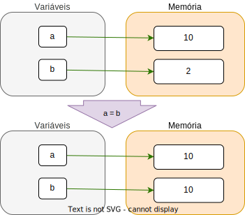
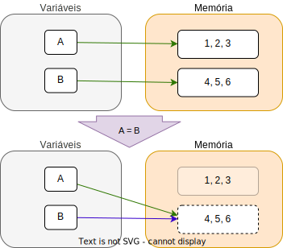

# Coleções em Python

Neste módulo, vamos estudar as **coleções** em Python. As coleções são estruturas de dados que permitem armazenar **múltiplos valores** em uma única variável.

   


---

# E se ...?

* No módulo anterior, vimos que uma variável pode armazenar **um valor**. Por exemplo, a variável `x` pode armazenar o valor `10`.
* Mas, e se quisermos armazenar dois valores?
  * Criamos duas variáveis `x` e `y`, certo?
* E se quisermos armazenar 100 valores?
  * Criamos 100 variáveis, `x1`, `x2`, ..., `x100` , certo?
* E se quisermos armazenar uma quantidade **indefinida** de valores?

---

# Coleções

Obviamente, criar uma variável para cada valor não é prático. Para armazenar uma quantidade grande ou indefinida de valores, usamos uma **coleção**.

* Em Python, existem **quatro tipos** de coleções básicas:
  * **Listas** (`list`)
  * **Tuplas** (`tuple`)
  * **Conjuntos** (`set`)
  * **Dicionários** (`dict`)

---
# Listas

* Uma lista é uma coleção de valores, onde cada valor é identificado por um **índice** correspondente à sua **posição** na lista.
* Uma lista é representada por colchetes `[]` e os valores são separados por **vírgula**.
* Por exemplo, a lista `numeros` abaixo contém 5 valores:
```python
numeros = [1, 2, 3, 4, 5]
```

---

## Características gerais de uma lista

- Uma lista pode conter **qualquer tipo de valor**.
- Uma mesma lista pode conter **valores de tipos diferentes** (heterogênea).
- Uma lista **não é um conjunto**, ou seja, 
  - os valores podem se **repetir**.
  - a **ordem** dos valores é importante.
  - os valores são associados a **índices**.

---

## Lista vazia

- Uma lista vazia é representada por `[]`.
- Uma lista vazia é **diferente** de uma variável **nula**.
- Se usada em um contexto booleano, uma lista vazia é considerada **falsa**.
- É comum usar uma lista vazia para **inicializar** uma lista que será **preenchida** posteriormente.
```python
lista = []
print(lista)
>>> []
```

---

## Acessando elementos de uma lista

- Para acessar um elemento de uma lista, usamos o **índice** do elemento.
- Python é ***zero based***, ou seja, os índices começam **sempre** em 0.
- Portanto, o maior indice de uma lista com `n` elementos é `n-1`.
- Por exemplo, para acessar o primeiro elemento da lista `numeros`, fazemos:

```python
numeros = [1, 2, 3, 4, 5]
print(numeros[0]) 
>>> 1
```

---

## Modificando elementos de uma lista

- Para **modificar** um elemento de uma lista, usamos o **índice** do elemento.
- Por exemplo, para modificar o segundo elemento da lista `numeros`, fazemos:

```python
numeros = [1, 2, 3, 4, 5]
numeros[1] = 10
print(numeros)
>>> [1, 10, 3, 4, 5]
```

---

## Índices fora do intervalo

- Se tentarmos acessar um índice **maior ou igual** ao tamanho da lista, ocorre um erro.
```python
numeros = [1, 2, 3, 4, 5]
print(numeros[5])
>>> IndexError: list index out of range
```

- Se tentarmos acessar um índice **negativo**, o Python conta a partir do final da lista.
```python
numeros = [1, 2, 3, 4, 5]
print(numeros[-1])
>>> 5
```
> É **bastante comum** usar `-1` para acessar o último elemento de uma lista.

---

### Observações sobre índices negativos

* O índice `-1` acessa o último elemento da lista.
* O índice `-k` acessa o k-ésimo elemento a partir do final da lista.
* O menor índice negativo é `-n`, onde `n` é o tamanho da lista.
  ```python
  numeros = [1, 2, 3, 4, 5]
  print(numeros[-6])
  >>> IndexError: list index out of range
  ```
* Índices negativos são uma **particularidade** do Python e **não são comuns** em outras linguagens.

---
## Atribuição com listas

Observer o seguinte código:

```python
A = [1, 2, 3]
B = [4, 5, 6]
A = B
B[0] = 10
print(A)
>>> [10, 2, 3]
print(B)
>>> [10, 5, 6]
```

> O que aconteceu?

---

* Quando trabalhamos com variáveis de **tipos primitivos**, como `int`, `float`, `str`, etc., a atribuição de uma variável a outra **copia** o valor da variável original para a nova variável.

* Porém, quando trabalhamos com **listas**, a atribuição de uma lista a outra **copia a referência** da lista original para a nova variável.

* Em outras palavras, `A = B` faz com que `A` e `B` **apontem para a mesma lista** na memória.

---

```python
# tipos primitivos
a = 10
b = 2

a = b

print(a)
>>> 2
print(b)
>>> 2
```
Com tipos primitivos, a atribuição `a = b` **copia** o valor de `b` para `a`.



---

```python
# listas
A = [1, 2, 3]
B = [4, 5, 6]

A = B

```

Com listas, a atribuição `A = B` faz com que `A` e `B` **apontem** para a **mesma lista**.

O espaço ocupado por `B` será **liberado** pelo *garbage collector*.




---
## Copiando listas

Se desejamos **copiar** o conteúdo de uma lista para outra, sem que as listas sejam **referências** da mesma lista, podemos usar a função `copy` ou o operador `[:]`.
- A função `copy`  *aloca* um **novo espaço** de memória e **copia** os elementos da lista original para esse novo espaço.

```python
A = [1, 2, 3]
B = A.copy() # ou B = A[:]
B[0] = 10
print(A)
>>> [1, 2, 3]
print(B)
>>> [10, 2, 3]
```

> Vamos aprender sobre `[:]` mais adiante.

---
## Comprimento de uma lista

- Para saber o número de elementos de uma lista, usamos a função `len`. 
```python
numeros = [1, 2, 3, 4, 5]
print(len(numeros))
>>> 5
```

---
## Operações com listas

* Além de acessar e modificar elementos, podemos realizar diversas operações com listas, como:
  * **Adicionar** elementos
  * **Remover** elementos
  * **Concatenar** listas
  * **Multiplicar** listas
  * **Ordenar** listas
  * **Inverter** listas
  * **Buscar** elementos
---

### Adicionando elementos

- Para adicionar um elemento ao final de uma lista, usamos o método `append`. [doc](https://docs.python.org/3/tutorial/datastructures.html)
```python
numeros = [1, 2, 3, 4, 5]
numeros.append(6)
print(numeros)
>>> [1, 2, 3, 4, 5, 6]
```

--- 

- Para adicionar um elemento em uma posição específica, usamos o método `insert`. [doc](https://docs.python.org/3/tutorial/datastructures.html)
```python
numeros = [1, 2, 3, 4, 5]
numeros.insert(2, 10) # Adiciona o valor 10 na posição 2
print(numeros)
>>> [1, 2, 10, 3, 4, 5]
```

> A **posição** deve ser entre `0` e o tamanho da lista.
> Os valores **após a posição** são **deslocados** para a direita.
> Portanto, o método `insert` é **menos eficiente** que o `append`.

---

- Para adicionar **todos os elementos** de uma lista `l2` ao final de uma lista `l1`, usamos o método `extend`. [doc](https://docs.python.org/3/tutorial/datastructures.html)
```python
numeros = [1, 2, 3, 4, 5]
outros_numeros = [6, 7, 8]
numeros.extend(outros_numeros)
print(numeros)
>>> [1, 2, 3, 4, 5, 6, 7, 8]
```

<br>

> **Experimente**, usar `append` no lugar de `extend` e veja o que acontece, o resultado é o mesmo?

---

### Removendo elementos

- Para remover um elemento de uma lista, usamos o método `remove`. [doc](https://docs.python.org/3/tutorial/datastructures.html)
- O método `remove` remove **apenas** primeira ocorrência do valor na lista.

```python
numeros = [1, 2, 3, 4, 5]
numeros.remove(3) # Remove o valor 3
print(numeros)
>>> [1, 2, 4, 5]
```

<br>
<br>

> **Atenção**: O parâmetro do método `remove` é o **valor** a ser removido, **não** a **posição**.


---

- Para remover uma elemento em uma dado **índice**, usamos o método `pop`. [doc](https://docs.python.org/3/tutorial/datastructures.html)
```python
numeros = [1, 2, 3, 4, 5]
x = numeros.pop(2) # Remove o valor na posição 2
print(numeros)
>>> [1, 2, 4, 5]
print(x)
>>> 3
```

- O método `pop(i)` remove o elemento na posição `i` e **retorna** o valor removido.
- Se não for passado nenhum argumento, o método `pop` remove o **último** elemento da lista.
- Valores **retornados** por funções **não precisam** ser necessariamente atribuídos a uma variável.
- Se a lista estiver vazia, o método `pop` gera um erro.

---

- Outra forma de remover um elemento de uma lista é usando o comando `del`. [doc](https://docs.python.org/3/tutorial/datastructures.html)
```python
numeros = [1, 2, 3, 4, 5]
del numeros[2] # Remove o valor na posição 2
print(numeros)
>>> [1, 2, 4, 5]
```
<br>
<br>

> Mais adiante, vamos ver que o comando `del` pode ser usado para remover vários elementos de uma lista de uma só vez.
---

- Para remover **todos os elementos** de uma lista, usamos o método `clear`. [doc](https://docs.python.org/3/tutorial/datastructures.html)
```python
numeros = [1, 2, 3, 4, 5]
numeros.clear()
print(numeros)
>>> []
```

---

### Concatenando listas

- Para concatenar duas listas, usamos o operador `+`.
```python
numeros = [1, 2, 3]
letras = ['a', 'b', 'c']
resultado = numeros + letras
print(resultado)
>>> [1, 2, 3, 'a', 'b', 'c']
```
- O operador de acunulação `+=` também pode ser usado para concatenar listas.
```python
numeros = [1, 2, 3]
letras = ['a', 'b', 'c']
numeros += letras
print(numeros)
>>> [1, 2, 3, 'a', 'b', 'c']
```

---

### Multiplicando listas

- Para multiplicar uma lista por um número `n`, usamos o operador `*`.
```python
numeros = [1, 2, 3]
resultado = numeros * 3
print(resultado)
>>> [1, 2, 3, 1, 2, 3, 1, 2, 3]
```

```python
zeros = [0] * 5
print(zeros)
>>> [0, 0, 0, 0, 0]
```

---

### Ordenando listas

- Para ordenar uma lista, usamos o método `sort`. [doc](https://docs.python.org/3/tutorial/datastructures.html)
- O método `sort` **modifica** a lista original.
- O método `sort` **não** funciona para listas com elementos de tipos diferentes.

```python
numeros = [3, 1, 4, 1, 5, 9, 2, 6, 5, 3, 5]
numeros.sort()
print(numeros)
>>> [1, 1, 2, 3, 3, 4, 5, 5, 5, 6, 9]
```

---

- Para ordenar uma lista **sem modificá-la**, usamos a função `sorted`. [doc](https://docs.python.org/3/library/functions.html#sorted)
- A função `sorted` **não** modifica a lista original.
- A função `sorted` **funciona** para listas com elementos de tipos diferentes.

```python
numeros = [3, 1, 4, 1, 5, 9, 2, 6, 5, 3, 5]
ordenados = sorted(numeros)
print(ordenados)
>>> [1, 1, 2, 3, 3, 4, 5, 5, 5, 6, 9]
print(numeros)
>>> [3, 1, 4, 1, 5, 9, 2, 6, 5, 3, 5]
```

<br>

> Observe que `sorted` é uma **função** *livre*, enquanto `.sort` é um **método** que está **atrelado** a um objeto.

---

### Invertendo listas

- Para inverter uma lista, usamos o método `reverse`. [doc](https://docs.python.org/3/tutorial/datastructures.html)
- O método `reverse` **modifica** a lista original.

```python
numeros = [1, 2, 3, 4, 5]
numeros.reverse()
print(numeros)
>>> [5, 4, 3, 2, 1]
```

---

### Buscando elementos

- Para checar se um elemento está em uma lista, usamos o operador `in`.
```python
numeros = [1, 2, 3, 4, 5]
if 3 in numeros:
    print('3 está na lista')
else:
    print('3 não está na lista')
```

- Para buscar a **posição** de um elemento, usamos o método `index`. [doc](https://docs.python.org/3/tutorial/datastructures.html)
```python
numeros = [1, 2, 3, 4, 5]
print(numeros.index(3))
>>> 2
```
- `.index` levanta um erro se o elemento não está na lista.

---

## Iterando sobre listas

- Para **iterar** sobre os **elementos** de uma lista, usamos um **laço** `for`.
```python
numeros = [1, 2, 3, 4, 5]
for numero in numeros:
    print(numero)
```

- Para **iterar** sobre os **índices** de uma lista, usamos a função `range`.
```python
numeros = [1, 2, 3, 4, 5]
for i in range(len(numeros)):
    print(numeros[i])
```

---

- Também podemos usar o laço `while` para **iterar** sobre os elementos de uma lista, mas é bem **menos prático**.
```python
numeros = [1, 2, 3, 4, 5]
i = 0
while i < len(numeros):
    print(numeros[i])
    i += 1
```

---
## Resumo de operações com listas

- **Adicionar** elementos: `append`, `insert`, `extend`
- **Concatenar** listas: `+`, `+=`
- **Remover** elementos: `remove`, `pop`, `del`, `clear`
- **Multiplicar** listas: `*`, `*=`
- **Ordenar** listas: `sort`, `sorted`
- **Inverter** listas: `reverse`
- **Buscar** elementos: `in`, `index`
- **Iterar** sobre listas: `for`, `range`, `while`
- **Copiar** listas: `copy`, `[:]`
- **Comprimento** de listas: `len`

---

## Exercícios de fixação

1. Crie uma lista `numeros` com os valores `1, 2, 3, 4, 5`.
2. Adicione o valor `6` ao final da lista.
3. Remova o valor `3` da lista.
4. Adicione o valor `10` na posição `2`.
5. Inverta a lista.
6. Ordene a lista.
7. Imprima o tamanho da lista.
8. Imprima o dobro de cada elemento da lista.

---

## Listas (*modo hacker*)

- Para se exibir para os amigos. você precisa dominar os conceitos de:
  - ***List Comprehension***
  - ***Slicing***


---

### *List Comprehension*

- É uma forma **concisa** de criar listas em Python.
- A sintaxe é:
  ```python
  [expressao for item in sequencia]
  ```
  Ou
  ```python
  [expressao for item in sequencia if condicao]
  ```

---
#### Exemplos

- Modo careta:
  ```python
  quadrados = []
  for i in range(1, 6):
      quadrados.append(i**2)
  ```
- Modo descolado:
  ```python
  quadrados = [i**2 for i in range(1, 6)]
  ```


---

- Modo careta:
  ```python
  pares = []
  for i in range(1, 11):
      if i % 2 == 0:
          pares.append(i)
  ```
- Modo descolado:
  ```python
  pares = [i for i in range(1, 11) if i % 2 == 0]
  ```

<br>

> **Dica**: Use *List Comprehension* sempre que possível, pois é mais **rápido** e **conciso**, além de ser **mais descolado** (elegante).  

---

### *Slicing*

- É uma forma de **acessar** partes de uma lista através de **índices**.
- Também conhecido como *fancy indexing*.
- A sintaxe é:
  ```python
  lista[inicio:fim:passo]
  ```
  - `inicio`: índice de início (inclusivo).
  - `fim`: índice de fim (exclusivo).
  - `passo`: intervalo entre os índices.
  - São os mesmos parâmetros da função `range`.


---

- `lista[:]`: toda a lista.
- `lista[a:]`: da posição `a` até o final.
- `lista[:b]`: do início até a posição `b` (exclusivo).
- `lista[a:b]`: da posição `a` até a posição `b` (exclusivo).
- `lista[::2]`: elementos de dois em dois.
- `lista[::-1]`: lista invertida.
- `lista[-3:]`: os três últimos elementos.
- `lista[:-3]`: todos os elementos, exceto os três últimos.
- `lista[6:2:-1]`: elementos da posição 6 até a posição 2 (exclusivo), de trás para frente.

---

#### Exemplos

##### Imprimindo uma fatia de uma lista:
```python
  numeros = [1, 2, 3, 4, 5, 6, 7, 8, 9, 10]
```
- Modo plebeu:
  ```python  
  for i in range(2, 7):
      print(numeros[i])
  ```

- Modo aristocrático:
  ```python
  print(numeros[2:7])
  ``` 

---

##### Copiando uma lista:
```python
  numeros = [1, 2, 3, 4, 5, 6, 7, 8, 9, 10]
```

- Modo plebeu:
  ```python
  copia = []
  for i in numeros:
      copia.append(i)
  ```
- Modo burguês:
  ```python
  copia = numeros.copy()
  ```
- Modo aristocrático:
  ```python
  copia = numeros[:]
  ```
---

##### Invertendo uma lista:
```python
  numeros = [1, 2, 3, 4, 5, 6, 7, 8, 9, 10]
```

- Modo plebeu:
  ```python
  for i in range(len(numeros)//2):
      aux = numeros[i]
      numeros[i] = numeros[-i-1]
      numeros[-i-1] = aux      
  ```
- Modo burguês:
  ```python
  numeros.reverse()
  ```
- Modo aristocrático:
  ```python
  numeros = numeros[::-1]
  ```

---

### Exercícios de fixação

Usando *Comprehension* ou *Slicing*:

1. Crie uma lista `numeros` com os valores `2, 4, 8, 16, 32, 64, 128, 256, 512, 1024`.
2. Inverta a lista.
3. Imprima os valores de índice par.
4. Substitua os valores dos últimos 3 índices por `0`.

---

### Algoritmos básicos com listas

- **Máximo** e **mínimo** de uma lista.
  - modo careta:
    ```python
    maximo = numeros[0]
    minimo = numeros[0]
    for i in numeros:
        if i > maximo:
            maximo = i
        if i < minimo:
            minimo = i
    ```
  - modo descolado:
    ```python
    maximo = max(numeros) 
    minimo = min(numeros)
    ```
---

- **Soma** e **produto** dos elementos de uma lista.
  - modo careta:
    ```python
    soma = 0
    produto = 1
    for i in numeros:
        soma += i
        produto *= i
    ```
  - modo descolado:
    ```python
    import math
    soma = sum(numeros)
    produto = math.prod(numeros)
    ```

---

- **Média** dos elementos de uma lista.
  - modo careta:
    ```python
    soma = 0
    for i in numeros:
        soma += i
    media = soma / len(numeros)
    ```
  - modo descolado:
    ```python
    media = sum(numeros) / len(numeros)
    ```
  - modo aristocrático:
    ```python
    from statistics import mean
    media = mean(numeros)
    ```
---

- **Contagem** de elementos em uma lista. "Quantos `3` tem na lista?"
  - modo careta:
    ```python
    contagem = 0
    for i in numeros:
        if i == 3:
            contagem += 1
    ```
  - modo descolado:
    ```python
    contagem = numeros.count(3)
    ```

> É importante **conhecer** e **praticar** os modos careta, pois eles **reforçam** os conceitos básicos de programação e algoritmos. Contudo, é **mais eficiente** usar os modos descolado e aristocrático, pois eles são **mais rápidos** e **concisos**.
---
### Observações sobre listas

* `max`, `min` e `sum` são exemplos de ***built-in functions***, ou seja, funções **nativas** do Python.
* **Python é lento** e há uma **grande diferença de performance** entre um algoritmo escrito **passo-a-passo** em Python e um ***built-in function***.
* Não faz sentido programar em **Python** como se fosse **C** ou **Java**.
* **Didaticamente**, é importante **entender** como essas funções funcionam, mas **na prática** é melhor usá-las.
* Outros exemplo de ***built-in functions*** são `len`, `sorted`, `reversed`, `enumerate`, `zip`, `filter`, `map`, `all`, `any`, `next`etc.

---

#### <!--fit --> Dizem que no Python, <br>**"menos é mais"**. Ou seja,<br> menos código<br>é mais **eficiente**, <br>é mais **elegante**.

<!-- _class: invert -->
<!-- _backgroundImage: url('https://spideryzarc.github.io/labCD/bg/dark_wood2.jpg') -->


---

## Tuplas

* Uma **tupla** é uma coleção **imutável** de valores.
* Uma tupla é representada por **parênteses** `()` e os valores são separados por **vírgula**.

```python
coordenadas = (10, 20)
```

---

### Características gerais de uma tupla

- Uma tupla pode conter **qualquer tipo de valor** (heterogênea).
- São semelhantes às listas, mas **imutáveis**.
  ```python
  coordenadas = (10, 20)
  coordenadas[0] = 5
  >>> TypeError: 'tuple' object does not support item assignment
  ```
- Tuplas são **mais rápidas** e **seguras** que listas. Pois, não podem ser modificadas acidentalmente.

---
### Observações sobre imutabilidade

- A **atribuição** abaixo **não** modifica a tupla original, mas cria uma **nova** tupla.
  ```python
  coordenadas = (10, 20)
  coordenadas = (5, 10)
  ```
- A **atribuição** abaixo **não** modifica a tupla original, mas um elemento de uma **lista** dentro da tupla. Ou seja, a tupla continua com seus **mesmos dois elementos**.
  ```python
  coordenadas = ([10, 20], [30, 40])
  coordenadas[0][0] = 5
  print(coordenadas)
  >>> ([5, 20], [30, 40])
  ```

---

### Acessando elementos de uma tupla

- Para acessar um elemento de uma tupla, usamos o **índice** do elemento.
- A sintaxe é a **mesma das listas**.
- Tuplas também suportam **índices negativos**.
- Tuplas também suportam **slicing**.
- Tuplas também suportam **iteração**.
- Tuplas também suportam **funções** como `max`, `min`, `sum`, etc.
- Tuplas também suportam **métodos** como `count` e `index`.
- Tuplas também suportam **concatenação** e **multiplicação**.

> Já aprendemos tudo isso com as listas, então não vamos repetir.

---

### Compreensão de tuplas

Tuplas **não** suportam *compreensão* diretamente, mas podemos usar a função `tuple` para criar uma tupla a partir de uma *compreensão*.

```python
t = tuple(i**2 for i in range(10))
print(t)
>>> (0, 1, 4, 9, 16, 25, 36, 49, 64, 81)
```

- **Atenção**: Podemos ser levados a pensar que `t = (i**2 for i in range(10))` cria uma tupla, mas na verdade cria um **gerador**.
  ```python
  t = (i**2 for i in range(10))
  print(t)
  >>> <generator object <genexpr> at 0x7f7f7f7f7f70>
  ```

> **Geradores** são um tema avançado e serão abordados mais adiante.


---
### Convertendo listas em tuplas e vice-versa

- Para converter uma lista em tupla, usamos a função `tuple`.
```python
numeros = [1, 2, 3, 4, 5]
t = tuple(numeros)
print(t)
>>> (1, 2, 3, 4, 5)
```

- Para converter uma tupla em lista, usamos a função `list`.
```python
coordenadas = (10, 20)
l = list(coordenadas)
print(l)
>>> [10, 20]
```

---

### Tuplas de um elemento

- Para criar uma tupla de um único elemento, é necessário **adicionar uma vírgula** após o elemento ou usar a função `tuple`.
```python
t = (10,) # ou t = tuple([10])
print(t)
>>> (10,)
```
- Caso contrário, o Python **não reconhece** como uma tupla.
```python
t = (10)
print(t)
>>> 10
```

---

### Desempacotamento de tuplas

Um dos *truques* mais legais do Python é o **desempacotamento** de tuplas.

```python
coordenadas = (10, 20)
x, y = coordenadas
print(x)
>>> 10
print(y)
>>> 20
```

- O desempacotamento de tuplas é uma forma **elegante** de atribuir valores a múltiplas variáveis de uma só vez.
- O número de variáveis deve ser **igual** ao número de elementos da tupla.

---

#### Desempacotamento de tuplas com menos variáveis:

```python
coordenadas = (10, 20, 30)
x, y, _ = coordenadas
print(x)
>>> 10
print(y)
>>> 20
```

- O **sublinhado** `_` é uma convenção para indicar que o valor não será usado, é uma **variável descartável**.

---

#### Usando desempacotamento para trocar valores:

Temos duas variáveis `a` e `b` e queremos trocar seus valores entre si (*swap*).
```python
  a = 10
  b = 20
```
- Modo careta:
  ```python
  aux = a
  a = b
  b = aux
  ```
- Modo descolado:
  ```python
  a, b = b, a
  ```
> Criamos uma tupla `(b, a)` e desempacotamos seus valores em `a` e `b`.

---

#### Usando desempacotamento em laços:

```python
pontos = [(1, 2), (3, 4), (5, 6)]
```

- Modo careta:
  ```python
  for ponto in pontos:
    x = ponto[0]
    y = ponto[1]
    print(x)
    print(y)
  ```
- Modo descolado:
  ```python
  for x, y in pontos:
    print(x)
    print(y)    
  ```

> O desempacotamento é feito automaticamente para cada tupla da lista.

---

### Exercícios de fixação

Usando tuplas:

1. Leia duas coordenadas no $R^2$ e calcule a distância entre elas.
2. Leia um inteiro $n$, em seguida, leia $n$ coordenadas no $R^2$ e imprima o centroide dessas coordenadas.
3. Leia um inteiro $n$, em seguida, leia $n$ valores inteiros e imprima a distância Euclidiana entre cada par de coordenadas.


---

## Conjuntos

* Um **conjunto** é uma coleção **não ordenada** de valores **únicos**.
* Um conjunto é representado por **chaves** `{}` e os valores são separados por **vírgula**.
* Por exemplo, o conjunto `pares` abaixo contém 3 valores únicos:
```python
pares = {2, 4, 6}
```
- Com poucas exceções, são **semelhantes** aos conjuntos da matemática.
---

### Características gerais de um conjunto

- Um conjunto **não** guarda valores **repetidos**.
- Um conjunto **não** garante a **ordem** dos valores.
- Um conjunto **não** suporta **índices** ou **slicing**.
- Nem  todos os tipos de valores podem ser armazenados em um conjunto.
  - Todos os tipos primitivos podem ser armazenados em um conjunto.
  - Listas, dicionários e outros conjuntos **não** podem ser armazenados em um conjunto.

---

### Convertendo listas em conjuntos e vice-versa

- Para converter uma lista em um conjunto, usamos a função `set`.
```python
numeros = [1, 2, 3, 4, 5]
s = set(numeros)
print(s)
>>> {1, 2, 3, 4, 5}
```

- Para converter um conjunto em uma lista, usamos a função `list`.
```python
pares = {2, 4, 6}
l = list(pares)
print(l)
>>> [2, 4, 6]
```

---

### Criando conjuntos vazios

- Uma **pegadinha** do Python é que **não** podemos criar um conjunto vazio com `{}`.
- Pois, `{}` é interpretado como um **dicionário vazio**.

```python
vazio = set()
print(vazio)
>>> set() 
```
- Abaixo, criamos um **dicionário vazio**.
```python
vazio = {} # Isso é um dicionário vazio, não um conjunto vazio.
print(vazio)
>>> {}
```

---
### Operações com conjuntos

- Adicionar elementos,
- Remover elementos,
- Verificar se um elemento está no conjunto,
- Iterar sobre os elementos do conjunto,
- Realizar operações de conjuntos (união, interseção, diferença, etc).
- Verificar se um conjunto é subconjunto ou superconjunto de outro conjunto.

---

### Adicionando elementos

- Para adicionar um elemento a um conjunto, usamos o método `add`.
```python
pares = {2, 4, 6}
pares.add(8)
print(pares)
>>> {2, 4, 6, 8}
```
- Para adicionar **vários elementos** a um conjunto, usamos o método `update`. 
```python
pares = {2, 4, 6}
pares.update([6, 10, 12])
print(pares)
>>> {2, 4, 8, 10, 12}
```
<br>

> Semelhante ao método `extend` das listas.
 
---

### Removendo elementos

- Para remover **um** elemento de um conjunto, usamos o método `remove`.
```python
pares = {2, 4, 6, 8}
pares.remove(6)
print(pares)
>>> {2, 4, 8}
```
- Ou usamos o método `discard`.
```python
pares = {2, 4, 6, 8}
pares.discard(6)
print(pares)
>>> {2, 4, 8}
```
- A diferença entre `remove` e `discard` é que `remove` gera um erro se o elemento não está no conjunto.
---

- Remover **todos** os elementos de um conjunto, usamos o método `clear`.
```python
pares = {2, 4, 6, 8}
pares.clear()
print(pares)
>>> set()
```

- Remover **vários elementos** de um conjunto, usamos o método `difference_update`.
```python
pares = {2, 4, 6, 8}
pares.difference_update({4, 8})
print(pares)
>>> {2, 6}
```

---

### Verificando elementos

- Para verificar se um elemento **pertence** ($\in$) a um conjunto, usamos o operador `in`.

```python
pares = {2, 4, 6, 8}
if 6 in pares:
    print('6 está no conjunto')
else:
    print('6 não está no conjunto')
```

---

### Iterando sobre conjuntos

- Para **iterar** sobre os elementos de um conjunto, usamos um **laço** `for`.
```python
pares = {2, 4, 6, 8}
for numero in pares:
    print(numero)
```
<br>

> Não podemos garantir a ordem dos elementos.

---

### Compreensão de conjuntos

- Assim como as listas, os conjuntos suportam *compreensão*.
- A sintaxe é:
  ```python
  A = {expressao for item in sequencia}
  ```
  ou
  ```python
  A = {expressao for item in sequencia if condicao}
  ```

---

#### Exemplo

- Modo careta:
  ```python
  quadrados_impar = set()
  for i in range(10):
      if i**2 % 2 != 0:
          quadrados_impar.add(i**2)
  ```
- Modo descolado:
  ```python
  quadrados_impar = {i**2 for i in range(10) if i**2 % 2 != 0}
  ```


---

#### Operações de conjuntos

- Python suporta **operações de conjuntos** como **união**, **interseção**, **diferença**, **diferença simétrica**, etc.
- Podem ser feitas usando **métodos** ou **operadores**.
  - **Métodos** são mais **verbosos** e **explícitos**.
  - **Operadores** são mais **concisos** e **elegantes**.

---
Seja:
```python
A = {1, 2, 3}
B = {3, 4, 5}
```
##### União de conjuntos

```python
C = A | B # ou C = A.union(B)
print(C)
>>> {1, 2, 3, 4, 5}
```

##### Interseção de conjuntos

```python
C = A & B # ou C = A.intersection(B)
print(C)
>>> {3}
```

---

##### Diferença de conjuntos

```python
C = A - B # ou C = A.difference(B)
print(C)
>>> {1, 2}
```

##### Diferença simétrica de conjuntos
Os elementos que estão em **A** ou em **B**, mas não em ambos.
```python
C = A ^ B # ou C = A.symmetric_difference(B)
print(C)
>>> {1, 2, 4, 5}
```

---
Seja:
```python
A = {1, 2, 3}
B = {1, 2}
```

##### Subconjuntos

```python
print(B <= A) # ou print(B.issubset(A)) 
>>> True
```

##### Superconjuntos

```python
print(A >= B) # ou print(A.issuperset(B))
>>> True
```

---

##### Subconjuntos próprios

```python
print(B < A) # ou print(B.issubset(A) and B != A)
>>> True
```

##### Superconjuntos próprios

```python 
print(A > B) # ou print(A.issuperset(B) and A != B)
>>> True
```

---

#### Igualdade de conjuntos

```python
A = {1, 2, 3}
B = {3, 2, 1}
print(A == B)
>>> True
```

---

### Atribuição de conjuntos

- Funciona de forma **semelhante** às listas e tuplas.
- Atribuição de conjuntos é **por referência**, ou seja, **não** cria uma cópia do conjunto.
```python
A = {1, 2, 3}
B = A 
B.add(4)
print(A)
>>> {1, 2, 3, 4}
```
<br>

> Dizemos que **B** é um ***alias*** de **A**.

---

### Copiando conjuntos

Usando o método `copy`, criamos um **novo** conjunto com os mesmos elementos de um conjunto existente.

```python
A = {1, 2, 3}
B = A.copy() # ou B = set(A)
B.add(4)
print(A)
>>> {1, 2, 3}
print(B)
>>> {1, 2, 3, 4}
```

<br>

> Também podemos fazer: `B = set(A)`.
 
---

### Exercícios de fixação

Usando conjuntos:

1. Leia duas listas de 10 inteiros e imprima a união, interseção e diferença simétrica entre elas.
2. Leia uma lista de 10 inteiros e imprima os valores únicos (sem repetição) da lista.
3. Leia uma lista de 10 inteiros e imprima os valores que aparecem mais de uma vez.

---

## Dicionários

* Um **dicionário** é uma coleção **mutável** de pares **chave-valor**.
* Um dicionário é representado por **chaves** `{}` e os pares são separados por **vírgula**.
* Cada par é formado por uma **chave** e um **valor**, separados por **dois pontos** `:`.
* Por exemplo, o dicionário `notas` abaixo contém 3 pares chave-valor:
```python
notas = {'Alice': 9.5, 'Bob': 8.0, 'Carol': 7.5}
```

---

### Características gerais de um dicionário

- Um dicionário **não** garante a **ordem** dos pares chave-valor.
- Os **valores** podem ser **qualquer tipo** de objeto.
- As **chaves** seguem as mesmas regras dos elementos de um conjunto, ou seja,
  - **Não** podem ser **mutáveis** (listas, dicionários, conjuntos).
  - **Podem** ser **imutáveis** (inteiros, floats, strings, tuplas, etc).
  - **Não** podem ser **repetidas**.

---

### Acessando elementos de um dicionário

- Para acessar um **valor** de um dicionário, usamos a **chave** correspondente entre **colchetes** `[]`.
```python
notas = {'Alice': 9.5, 'Bob': 8.0, 'Carol': 7.5}
print(notas['Alice'])
>>> 9.5
```
- Se a chave não existe, o Python gera um erro.
```python
print(notas['David'])
>>> KeyError: 'David'
```

---

- Uma alternativa é usar o método `get`, que **retorna** um valor padrão se a chave não existe.
  ```python
  print(notas.get('David', 0))
  >>> 0
  ```
  - Se a chave existe, o valor correspondente é retornado.
  - Se a chave não existe, o valor **padrão** é retornado.

---

### Adicionando elementos

- Para adicionar um **novo par** chave-valor a um dicionário, basta atribuir um valor a uma **nova chave**.
```python
notas = {'Alice': 9.5, 'Bob': 8.0, 'Carol': 7.5}
notas['David'] = 6.0
print(notas)
>>> {'Alice': 9.5, 'Bob': 8.0, 'Carol': 7.5, 'David': 6.0}
```
- Se a chave já existe, o valor é **substituído**.

---

### Removendo elementos

- Para remover um **par** chave-valor de um dicionário, usamos o comando `del`. 
  ```python
  notas = {'Alice': 9.5, 'Bob': 8.0, 'Carol': 7.5}
  del notas['Bob']
  print(notas)
  >>> {'Alice': 9.5, 'Carol': 7.5}
  ```

- Também podemos usar o método `pop`, que **retorna** o valor removido.

  ```python
  notas = {'Alice': 9.5, 'Bob': 8.0, 'Carol': 7.5}
  valor = notas.pop('Bob')
  print(valor)
  >>> 8.0
  ```
- Se a chave não existe, o Python gera um erro.

---

- Para remover sem gerar erro, usamos o método `pop` com um **valor padrão**.
  ```python
  notas = {'Alice': 9.5, 'Bob': 8.0, 'Carol': 7.5}
  valor = notas.pop('David', 0)
  print(valor)
  >>> 0
  ```
- Se a chave **não existe**, o valor **padrão** é retornado.

---

## Compreensão de dicionários

- Assim como as listas e conjuntos, os dicionários suportam *compreensão*.
- A sintaxe é:
  ```python
  D = {chave: valor for item in sequencia}
  ```
  ou
  ```python
  D = {chave: valor for item in sequencia if condicao}
  ```

---

### Exemplo de compreensão de dicionários

- Modo careta:
  ```python
  quadrados = {}
  for i in range(1, 6):
      quadrados[i] = i**2
  ```
- Modo descolado:
  ```python
  quadrados = {i: i**2 for i in range(1, 6)}
  ```
---

## Convertendo listas em dicionários

- Para converter uma lista de pares chave-valor em um dicionário, usamos a função `dict`.
```python
pares = [('Alice', 9.5), ('Bob', 8.0), ('Carol', 7.5)]
notas = dict(pares)
print(notas)
>>> {'Alice': 9.5, 'Bob': 8.0, 'Carol': 7.5}
```

- Se temos duas listas, uma com as chaves e outra com os valores, podemos usar a função `zip`.
```python
nomes = ['Alice', 'Bob', 'Carol']
notas = [9.5, 8.0, 7.5]
d = dict(zip(nomes, notas))
print(d)
>>> {'Alice': 9.5, 'Bob': 8.0, 'Carol': 7.5}
```

---

### Iterando sobre dicionários

- Podemos iterar sobre as **chaves**, os **valores** ou os **pares chave-valor** de um dicionário.
  - Para iterar sobre as **chaves**, usamos o método `keys`.
  ```python
  for chave in notas.keys():
      print(chave)
  ```
  - Para iterar sobre os **valores**, usamos o método `values`.
  ```python
  for valor in notas.values():
      print(valor)
  ```
  - Para iterar sobre os **pares chave-valor**, usamos o método `items`.
  ```python
  for chave, valor in notas.items():
      print(chave, valor)
  ```
---

### Exercícios de fixação

Usando dicionários:

1. Leia uma lista de 10 inteiros e imprima se houve ou não repetição de valores, e se houve, quais são os valores repetidos e quantas vezes eles aparecem.
2. Leia o nome de 3 alunos e, em seguinda, pergunte a idade de cada um (pelo nome), a altura e o peso. Armazene esses dados em um dicionário.
3. Com os dados do exercício anterior, calcule a média de idade, altura e peso dos alunos.
4. Com os dados do exercício anterior, crie e exiba um dicionário com o IMC de cada aluno.

---

## Resumo


- **Listas**: coleção **ordenada** e **mutável** de valores.
  - `append`, `insert`, `extend`, `+`, `*`, `remove`, `pop`, `del`, `clear`, `sort`, `sorted`, `reverse`, `in`, `index`, `copy`, `len`, `list`.
- **Tuplas**: coleção **imutável** de valores.
- **Conjuntos**: coleção **não ordenada** de valores **únicos**.
  - `add`, `update`, `remove`, `discard`, `clear`, `difference_update`, `in`, `for`, `|`, `&`, `-`, `^`, `<=`, `>=`, `<`, `>`, `==`, `copy`, `set`. 
- **Dicionários**: coleção **mutável** de pares **chave-valor**.
  - `get`, `add`, `update`, `remove`, `pop`, `keys`, `values`, `items`, `dict`, `zip`. 
- ***Comprehension***: listas, conjuntos e dicionários.
- ***Slicing***: listas e tuplas. 

---

# Um comentário final

- Quando aprendemos a programar em outras linguagens, como **C** ou **Java**, aprendemos a trabalhar **primeiro** com **vetores** (*arrays*). 
- A pesar de mais **eficientes**, vetores são estruturas de dados mais **simples** e **limitadas**. 
- Ao optar pela linguagens de **alto nível**, como **Python**, temos acesso a **estruturas de dados mais complexas** e **poderosas** logo de início.
- O funcionamento interno dessas estruturas é **complexo**, e é abordado em disciplinas de **estrutura de dados** e **algoritmos**.
- Apesar disso, é importante **conhecer** e **usar** essas estruturas de dados, ou **não faz sentido** usar Python.


---

# Conclusão

Python oferece uma forma **simples** e **elegante** de trabalhar com coleções de dados, que em outras linguagens seriam mais complexas e verbosas. 

É necessário conhecer e usar corretamente essas estruturas de dados para **tornar o código mais eficiente** e **elegante**. 

Embora possamos usar listas para cálculos vetoriais e matriciais, é mais eficiente usar *arrays* do módulo `numpy`, que serão abordados em aulas futuras.


