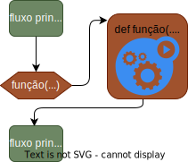

# Funções em Python

Quando nos deparamos com um problema complexo, é comum quebrá-lo em partes menores. 
Tratamos cada parte separadamente, resolvendo-a de forma isolada.


Chamamos essas partes menores de **funções**, **sub-rotinas** ou **procedimentos**.


---

## Definição de Função

* Uma função é um bloco de código que executa uma tarefa específica. 
* Possui um **nome**, que é usado para chamá-la.
* Pode receber **parâmetros** de entrada.
* Pode **retornar** um valor de **saída**.
* Sintaxe da definição de uma função básica:
    ```python
    def nome_da_funcao(parametro1, parametro2):
        # bloco de código
        return valor_de_saida
    ```
* Sintaxe da chamada de uma função:
    ```python
    nome_da_funcao(valor1, valor2)
    ```

---

## Semântica de Funções

- A **definição** de uma função **não executa** imediatamente, o código dentro da função é executado somente quando a função é **chamada**.
- O programa segue o **fluxo** de execução **principal** até encontrar uma **chamada** de função.
- A execução do programa é transferida para a função.
- Após a execução da função, o fluxo de execução **retorna** ao ponto de chamada.
- Se a função retorna um valor, este **'substitui'** a chamada da função.




---

## Uso mais comum de funções

* **Reutilização de código**: evita **repetição** de código.
* **Organização**: facilita a **leitura** e manutenção do código.
* **Abstração**: **esconde detalhes** de implementação.

---

### Exemplo de Reutilização de Código
O código abaixo ler a nota de um aluno e uma pontuação extra, e imprime a situação do aluno (aprovado, recuperação ou reprovado) sem e com a pontuação extra.

```python
def status(nota):
    if nota >= 7:
        return 'Aprovado'
    elif nota >= 5:
        return 'Recuperação'
    else:
        return 'Reprovado'
# fluxo principal
nota = float(input('Digite a nota: '))
ponto_extra = float(input('Digite o ponto extra: '))
print('Situação sem ponto extra: ', status(nota))
print('Situação com ponto extra: ', status(nota+ponto_extra))
```
Observer que o programador teria que **repetir** o código de decisão para cada caso, sem a função `status`.

<!-- _footer: '' -->

---

### Exemplo de Organização
O código abaixo lê um número e imprime se ele é par ou ímpar.

```python
def par_impar(num):
    if num % 2 == 0:
        return 'Par'
    else:
        return 'Ímpar'
# fluxo principal
numero = int(input('Digite um número: '))
print('O número é', par_impar(numero))
```
A função `par_impar` organiza o código de decisão, facilitando a leitura e manutenção do código.
- Quando lemos a **definição da função**, fica **fácil entender** o que ela faz.
- Quando lemos o **fluxo principal**, fica **fácil entende**r o que o programa como um todo faz.

---

### Exemplo de Abstração
O código abaixo lê dois números e imprime a fração simplificada.
```python
def mdc(a, b):
    # Algortimo de Euclides para calcular o MDC
    while b != 0:
        a, b = b, a % b
    return a
# fluxo principal
numerador = int(input('Digite o numerador: '))
denominador = int(input('Digite o denominador: '))
mdc = mdc(numerador, denominador)
print('Fracao simplificada:', numerador//mdc, '/', denominador//mdc)
```
- Compreender como o algoritmo de Euclides funciona **não** é uma tarefa **trivial**.
- Mas, uma vez que você "**aceita**" que a função `mdc` faz o que promete, você pode usá-la sem se preocupar com os **detalhes** de implementação.

---

#### <!-- fit --> Quem vê as árvores não vê a floresta

Na programação, o conceito de **abstração** é essencial para lidar com a complexidade. Abstrair significa **ocultar os detalhes de implementação**. 

Primeiro, você precisa **entender** como algo funciona. Depois, você pode **usá-lo** sem se preocupar com os detalhes.

---

## Definindo Funções

Já usamos funções desde o início do curso, como `print`, `input`, `int`, `float`, `str`, `len`, `range`, etc. É hora de aprender a **criar nossas próprias funções**.

```python
def seja_educado():
    print('Como você está?')
    print('Tenha um bom dia!')

# fluxo principal
seja_educado()
seja_educado()
```
- A função `seja_educado` é bastante simples, nada mais é do que uma **sequência de instruções** a qual chamamos de 'seja_educado()'.
- Uma vez definida, a função pode ser chamada **quantas vezes** quisermos onde quisermos.

---

### Parâmetros/Argumentos

Podemos passar informações para uma função através de parâmetros. Os parâmetros são variáveis que recebem valores quando a função é chamada.

```python
def seja_educado(nome):
    print(f'Como você está, {nome}?')
    print('Tenha um bom dia!')
# fluxo principal
seja_educado('Maria')
seja_educado('João')
```
- A função `seja_educado` agora recebe um parâmetro `nome`. Esse parâmetro é usado para personalizar a mensagem.
- A função é chamada duas vezes no **fluxo principal**, passando nomes diferentes. Por isso, as mensagens são personalizadas.
- A função agora é mais **genérica** e **reutilizável**.

---

### Retorno

Uma função pode retornar um **valor de saída**. O valor de retorno é especificado com a palavra-chave `return`. Ao encontrar um `return`, a função é encerrada e o valor "**substitui**" a chamada da função.

```python
def fat(n):
    f = 1
    for i in range(1, n+1):
        f *= i
    return f
# fluxo principal
resultado = fat(5) + fat(3) + fat(4)
print('5! + 3! + 4! =', resultado)
```
- A função é chamada três vezes no **fluxo principal**, passando números diferentes. O retorno é somado e impresso.
- A função é **reutilizável** e **abstrai** o cálculo do fatorial. 

---

- `return` **encerra a função** e retorna um valor.
- `return` pode ser usado em **qualquer lugar** da função.
- `return` pode aparecer **mais de uma** vez em uma função.
- `return` pode ser usado para encerrar a função **sem retornar um valor**.
- Se você **retornar uma tupla**, é como se você estivesse **retornando vários valores**, o que é uma **vantagem** do Python em relação a outras linguagens.

---

### Exemplo de Retorno de Múltiplos Valores

```python
def min_max(lista):
    minimo = min(lista)
    maximo = max(lista)
    return minimo, maximo
# fluxo principal
numeros = [10, 5, 7, 3, 8]
menor, maior = min_max(numeros)
print('Menor:', menor)
print('Maior:', maior)
```
- A função `min_max` retorna o menor e o maior valor de uma lista.
- No **fluxo principal**, os valores de retorno são atribuídos a duas variáveis, que são impressas.
- O Python permite **desempacotar** os valores de retorno em variáveis separadas.

---

### Exemplo de `return` em Qualquer Lugar

```python
def eh_primo(n):
    if n < 2:
        return False # se n < 2, não é primo e a função é encerrada aqui
    for i in range(2, n):
        if n % i == 0:
            return False # se n é divisível por i, não é primo e a função é encerrada aqui
    return True # se n não é divisível por nenhum i, é primo

# fluxo principal
numero = int(input('Digite um número: '))
if eh_primo(numero):
    print('É primo')
else:
    print('Não é primo')
```

> Observe que **não há necessidade** de vários `else` pois `return` **encerra a função**.

---

### Exemplo de `return` sem Valor

```python
def seja_educado(nome):
    if nome == 'Albert':
        return
    print(f'Como você está, {nome}?')
    print('Tenha um bom dia!')

# fluxo principal
seja_educado('Maria')
seja_educado('Albert')
seja_educado('João')
```
- A função `seja_educado` não imprime nada se o nome for 'Albert'.
- O `return` sem valor encerra a função imediatamente, mesmo retornando nada.

---

### Ignorando o Retorno

Você pode **ignorar** o valor de retorno de uma função, se não precisar dele. 

```python
def soma(a, b):
    c = a + b
    print('A soma é', c)
    return c

# fluxo principal
soma(10, 20) # o valor de retorno é ignorado
```


---

## Escopo de Variáveis

O **escopo** de uma variável é a região do programa onde a variável é visível e pode ser usada. Em Python, existem dois tipos de escopo:

- **Escopo Local**: variáveis definidas dentro de uma função são visíveis apenas dentro da função.
- **Escopo Global**: variáveis definidas fora de qualquer função são visíveis em todo o programa.

Imagine que, para usar uma função, você precisasse saber **o nome de todas as variáveis** que ela usa internamente. O conceito de **escopo** permite que você use funções sem **se preocupar** com as variáveis internas.

---

```python
def funcao():
    x = 10   # variável local
    print(x)
# fluxo principal
funcao()
print(x)
>>> NameError: name 'x' is not defined
```
- A variável `x` é definida dentro da função `funcao`, portanto, é uma **variável local**.
- A variável `x` **não é visível fora da função**.
- Variáveis locais são **destruídas** quando a função termina.
- Variáveis globais permanecem **vivas** durante toda a execução do programa.
 
 ---

 ### Ofuscamento de Variáveis

Variáveis locais **ocultam** variáveis globais com o mesmo nome.

```python
x = 10        # variável global
def funcao():
    x = 20    # variável local (é uma nova variável)
    print(x)
# fluxo principal
funcao()
print(x)
```

- A variável `x` dentro da função `funcao` **oculta** a variável `x` global.
- A variável `x` global não é afetada pela variável `x` local.
- Se você deseja **modificar** uma variável global dentro de uma função, use a palavra-chave `global`.

---

### Modificando Variáveis Globais com `global`

A palavra-chave `global` permite que você modifique uma variável global dentro de uma função.

```python
x = 10        # variável global
def funcao():
    global x  # avisa que 'x' é global
    x = 20    # modifica 'x' global
    print(x)
# fluxo principal
funcao()
print(x)
```

> Devemos **evitar** alterar variáveis **globais** dentro de funções, pois isso pode tornar o código difícil de **entender** e depurar.

---

### Escopo de Funções

Toda vez que uma função é executada, é somo se fosse um *mini-programa* que tem seu próprio escopo, ou seja, suas próprias variáveis locais.

- O que ocorre dentro da função **não afeta** o que ocorre fora dela.
- O que ocorre fora da função **não afeta** o que ocorre dentro dela.
- Você pode decidir usar variáveis globais dentro de uma função, mas é **melhor** evitar.
  - As informações de entrada devem ser passadas como **parâmetros**.
  - As informações de saída devem ser retornadas como **valores de retorno**.


---

## Tipos de Parâmetros

Python possui quatro tipos de parâmetros:
- **Obrigatórios**: devem ser passados na chamada da função.
- **Opcionais**: têm um valor padrão e são opcionais na chamada da função.
- **Variáveis**: recebem um número variável de argumentos.
- **Chave-Valor**: são passados como pares `chave=valor`.

---

### Parâmetros Obrigatórios

São os tipos mais comuns de parâmetros. Eles devem ser passados na chamada da função.

```python
def div(a, b):
    return a // b
# fluxo principal
print(div(10, 2)) # valores são passados na ordem
>>> 5
print(div(2, 10)) # valores são passados na ordem
>>> 0
print(div(b=2, a=10)) # nomeando os parâmetros, a ordem não importa
>>> 5
```
- Todos devem receber um valor na chamada da função.
- A tribuição é feita pela **ordem** dos parâmetros, ou
- pode-se usar a **chave** do parâmetro na chamada.

---

### Parâmetros Opcionais

Basta colocar um valor padrão na definição do parâmetro para torná-lo opcional.

```python
def div(a=10, b=2):
    return a // b
# fluxo principal
print(div()) # valores padrão são usados
>>> 5
print(div(2)) # valor de 'a' é passado, 'b' usa o padrão
>>> 1
print(div(2, 10)) # valores são passados na ordem
>>> 0
print(div(b=10)) # nomeando o parâmetro 'b', 'a' usa o padrão
>>> 1
print(div(b=10, a=2)) # nomeando os parâmetros, a ordem não importa
>>> 0
```
- Se n**ão forem passados**, os valores **padrão são usados**.
- Devem colocados **após** os parâmetros **obrigatórios** na definição da função.

---

### Parâmetros Variáveis

Basta colocar um asterisco `*` antes do nome do parâmetro para torná-lo variável.

```python
def soma(*numeros):
    s = 0
    for n in numeros:
        s += n
    return s
# fluxo principal
print(soma(1, 2, 3, 4, 5))
>>> 15
print(soma(10, 20, 30))
>>> 60
```

- O parâmetro `*numeros` recebe um número variável de argumentos.
- Os argumentos são **empacotados** em uma **tupla**.
- A função pode ser chamada com **qualquer número** de argumentos.
- Deve ser listado após os parâmetros **obrigatórios** e **padrão** na definição da função.

---

### Parâmetros Nomeados

```python
def imprime_dados(**dados):
    for chave, valor in dados.items():
        print(f'{chave}: {valor}')
# fluxo principal
imprime_dados(nome='Maria', idade=30, cidade='São Paulo')
```

- O parâmetro `**dados` recebe um número **variável** de argumentos **nomeados**.
- Os argumentos são **empacotados** em um dicionário.
- A função pode ser chamada com **qualquer número** de argumentos nomeados.
- Deve ser listado depois dos parâmetros **obrigatórios** e **opcionais** na definição da função.

---

### Exemplo com Todos os Tipos de Parâmetros

Apenas para ilustrar, é possível usar todos os tipos de parâmetros em uma única função. **Não é comum**, mas é possível.

```python
def teste(a, b=10, *c, **d):
    print('a:', a)
    print('b:', b)
    print('c:', c)
    print('d:', d)
# fluxo principal
teste(1, 2, 3, 4, 5, nome='Maria', idade=30)
>>> a: 1
>>> b: 2
>>> c: (3, 4, 5)
>>> d: {'nome': 'Maria', 'idade': 30}
```


---

## Desempacotando Argumentos na Chamada de Funções

Seja:
```python
def modulo(x, y):
    return (x**2 + y**2)**0.5
# fluxo principal
coord = (3, 5)
```
- Chamando a função no modo *careta*:
```python
x = modulo(coord[0], coord[1])
```

- Modo *descolado*
```python
x = modulo(*coord)
```
O operador `*` desempacota a tupla `coord` e passa seus elementos como argumentos para a função `modulo` na ordem.

<!-- _footer: '' -->
---

## Desempacotamento de Parâmetros Por Nome
Seja:
```python
def imprime_dados(nome, idade, cidade):
    print(f'Nome: {nome}')
    print(f'Idade: {idade}')
    print(f'Cidade: {cidade}')
# fluxo principal
dados = {'nome': 'Maria', 'idade': 30, 'cidade': 'São Paulo'}
```

- Chamando a função no modo *careta*:
```python
imprime_dados(dados['nome'], dados['idade'], dados['cidade'])
```

- Modo *descolado*
```python
imprime_dados(**dados)
```

---

## Desempacotamento

- O operador `**` desempacota um **dicionário** e passa seus pares `chave=valor` como argumentos nomeados para a função.
- O operador `*` desempacota uma **sequência** e passa seus elementos como argumentos posicionais para a função.
- O desempacotamento é uma forma **elegante** de passar argumentos para funções, **quando** os argumentos estão **armazenados em uma sequência ou dicionário**.


---

## Funções Recursivas

Uma função é **recursiva** quando ela **chama a si mesma**. A recursão é um conceito poderoso, mas deve ser usada com **cuidado**.

```python
def fatorial(n):
    if n == 0: # âncora
        return 1
    return n * fatorial(n-1) # recursão
# fluxo principal
print(fatorial(5))

```

- A função `fatorial` é definida em termos de si mesma.
- A condição de parada (âncora)  é `n == 0`, que retorna 1.
- Toda recursão deve ter uma **condição de parada**, caso contrário, a função chamará a si mesma indefinidamente até **estourar** a pilha de execução. 

--- 

### Pilha de Execução

* Toda vez que uma função é chamada, o Python **empilha** um novo quadro de execução.
* Esse quadro contém as variáveis locais da função, os parâmetros e o ponto de retorno.
* Por exemplo, `fatorial(5)` chama `fatorial(4)`, que chama `fatorial(3)`, e assim por diante.
* Por tanto, as chamadas recursivas ocupam espaço na memória, e se a recursão for muito profunda, pode **estourar** a pilha de execução.


---

### Exemplo de Recursão

```python
def fibonacci(n):
    if n <= 1: # âncora
        return n
    return fibonacci(n-1) + fibonacci(n-2) # recursão
# fluxo principal
print(fibonacci(5))
```

- A função `fibonacci` calcula o n-ésimo número da sequência de Fibonacci.
- A condição de parada (âncora) é `n <= 1`, que retorna `n`.
- A função é definida em termos de si mesma, chamando `fibonacci(n-1)` e `fibonacci(n-2)`.
- A recursão é uma forma elegante de resolver problemas que podem ser **divididos** em subproblemas **menores**.
- Porém, a recursão pode ser **ineficiente** para problemas muito grandes.

---
- Qual é a forma mais eficiente de calcular o n-ésimo número da sequência de Fibonacci?
  1. Usar recursão.
    ```python
    def fibonacci(n):
        if n <= 1: return n
        return fibonacci(n-1) + fibonacci(n-2)
    ```
   
  2. Usar um laço.   
    ```python
    def fibonacci(n):
        a, b = 0, 1
        for _ in range(n):
            a, b = b, a + b
        return a
    ```
  3. Usar a fórmula de Binet.
    ```python
    def fibonacci(n):
        phi = 1.618033988749
        return round((phi**n - (-phi)**-n) / 5**0.5)
    ```
<!-- _footer: '' -->

---

## Exercícios

1. Escreva uma função que recebe um número e retorna o seu quadrado.
2. Escreva uma função que recebe dois números e retorna o maior deles.
3. Usando a função anterior, escreva uma função que recebe quatro números e retorna o maior deles.
4. Escreva uma função que retorna a raiz de um número, como no exemplo:
    ```python
    print(raiz(9)) # 3.0 raiz quadrada
    print(raiz(8, 3)) # 2.0 raiz cúbica
    ```
5. Escreva uma função que recebe um ou mais números e retorna a média aritmética.
 
