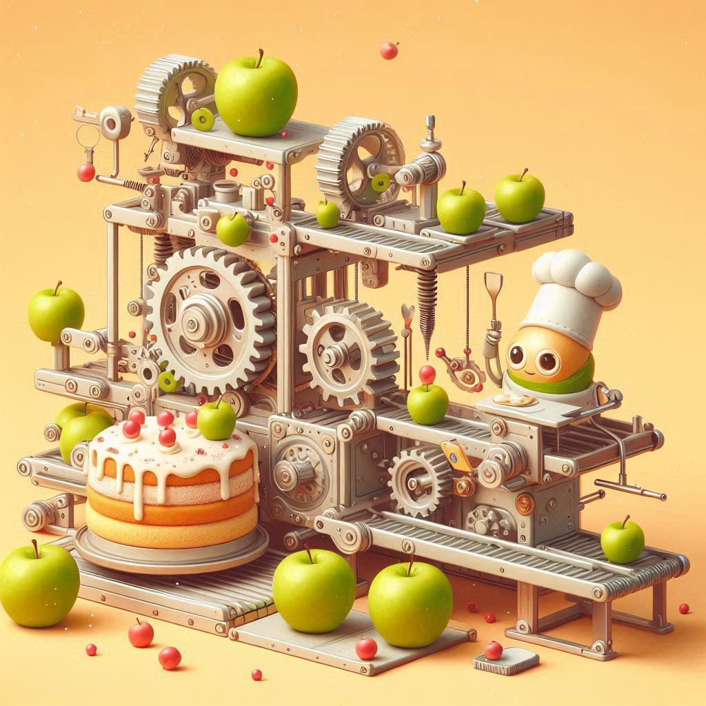
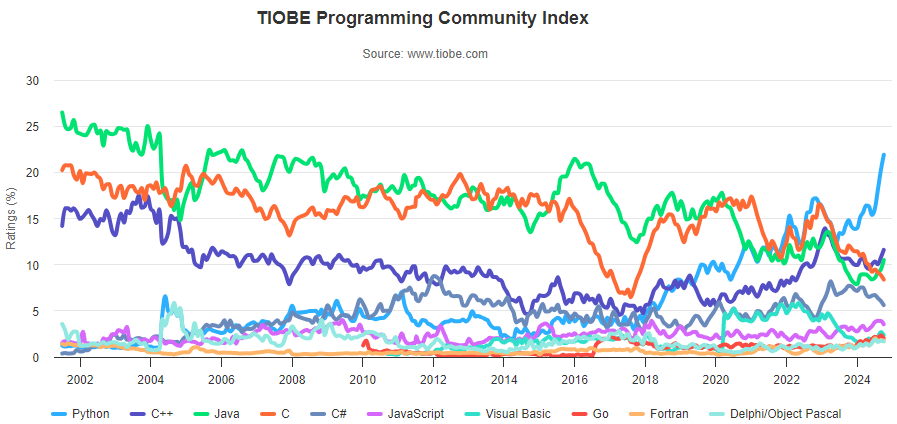

# Lógica de Programação e Python

> **Objetivo:** Apresentar os conceitos básicos de lógica de programação e suas aplicações em **Python**.


<!-- _backgroundImage: url('https://spideryzarc.github.io/labCD/bg/light_desk.jpg') -->
<!-- _footer: "" -->
---

# Raposa

Um fazendeiro viaja com uma **raposa**, uma **ovelha** e um pouco de **feno**. Certo momento ele precisa **atravessar um rio** utilizando um barco que somente suporta **ele e mais um animal ou item**. 

Se ele deixar a raposa junto com a ovelha, esta e comida. A ovelha, por sua vez, come o feno se for deixada sozinha com ele. 

Quais passos o fazendeiro deve fazer para conseguir atravessar o rio sem perder os
animais ou o feno?


---

# O Que é um Computador?

* É uma máquina de fazer contas ?
* É uma máquina de processar dados ?
* É uma máquina inteligente ?
* **É Mágica?**

<!-- imagem de um computador mágico -->


---

# Fábrica de Bolos

Sua tarefa e projetar uma máquina que produza bolos de Maçãs.

**O que você precisa saber para projetar essa máquina?**


<!-- imagem de um bolo de maçã -->


---

##### <!--fit--> Como se faz um bolo de maçã!!

---

* Você aprendeu a fazer um bolo de maçã.
* Juntou seu diploma de engenharia e, depois de algumas tentativas, conseguiu fazer sua máquina de fazer bolos de maçã.
* Sua maquina recebe maçãs açúcar, farinha, manteiga e canela. E produz bolos.     
*  **Sucesso!!**
  



---

Mas o tempo da colheita de maçãs acabou e agora você precisa fazer bolos de **abacaxi**.

**O que você faz?**

* Coloca abacaxis na máquina e vê o que acontece?
* Desmonta a máquina e tenta fazer outra?
* Projeta e constrói uma nova máquina?
* Outra coisa?

<!-- imagem de um bolos de abacaxi -->


---

# E se ...

Você inventasse uma máquina que pudesse receber os **ingredientes** e a **receita** e produzir o bolo seguindo a receita?

* Nesta maquina, você deve fornecer os ingredientes e a receita.
* **Não** é uma máquina de fazer bolos de maçã ou de abacaxi.

---


##### <!--fit--> É uma máquina de executar receitas!


---

# O que é um Computador?

* É uma máquina que executa **instruções**.
* As instruções são fornecidas por um **programa**.
* O programa é um conjunto de **algoritmos**.
* Um algoritmo é uma sequência de **passos** para resolver um problema.
  * Lembram da **raposa**?
  
---

# Metaforicamente

* A **entrada** são os ingredientes.
* A **receita** é o **algoritmo** ou **programa**.
* A **saída** é o bolo.

---

<!-- _class: invert -->
<!-- _backgroundImage: url('https://spideryzarc.github.io/labCD/bg/dark_lamp.jpg') -->

##### <!--fit --> Saber **programar** é <br>saber **escrever a receita**<br> para  a **máquina** que faz o<br> **bolo**.


---

# Python

Neste curso, vamos aprender a **programar** em **Python**, em seguida, aprenderemos um pouco de **C**.


---

## Histórico

- **Guido Van Rossum**, criou o Python. Ele começou em **1989** no Centrum Wiskunde & Informatica (CWI), inicialmente como um projeto de *hobby* para se manter ocupado durante o **Natal**. 
- O nome da linguagem foi inspirado no programa de TV da BBC “**Monty Python’s Flying Circus**”, porque Guido Van Rossum era um grande fã do programa. 


---

### Principais Marcos

- **1991** - Primeira versão do código Python (versão 0.9.0) foi publicada.
- **1994** - O Python 1.0 foi lançado com novas funções para processar listas, como **mapear**, **filtrar** e **reduzir**.
- **2000** - O Python 2.0 foi lançado com novos recursos úteis, como suporte para caracteres [Unicode](https://pt.wikipedia.org/wiki/Unicode) e um modo mais rápido de percorrer uma lista.
- **2008** - foi lançado o **Python 3.0**. 

[Fonte](https://aws.amazon.com/pt/what-is/python/#:~:text=altera%C3%A7%C3%B5es%20no%20c%C3%B3digo.-,Qual%20%C3%A9%20a%20hist%C3%B3ria%20do%20Python%3F,manter%20ocupado%20durante%20o%20Natal.)


---

## Popularidade e Uso


O índice [Tiobe](https://www.tiobe.com/tiobe-index/) é uma medida da popularidade de uma linguagem de programação com base na **quantidade de pesquisas** na web.

---

###### <!-- fit --> Quanto **mais popular**, **mais fácil** de encontrar <br> **ajuda** e **recursos**!

---

## Por que Python?

* **Simples e Fácil de Aprender**
* **Versátil e Poderoso**
* **Comunidade Ativa**
* **Grande Biblioteca Padrão**
* **Open Source**
* **Multiplataforma**

---

## Qual a Grande Desvantagem do Python?

##### <!--fit--> **Python é lento!**

> Quando estivermos mais avançados, **me lembre** de falar sobre isso.

---

# Formas de Utilizar Python

- **Interativo**: **Shell** ou **Console**, os comandos são executados imediatamente.
- **Script**: Arquivo com extensão `.py` que contém um conjunto de instruções.
- **Notebook**: Ambiente interativo que permite combinar texto, código e gráficos. (Jupyter, Google Colab, etc.)

> Neste curso, vamos focar em **scripts**.

---

# Ambiente de Desenvolvimento (IDE)

- **IDE** (Integrated Development Environment) é um ambiente de desenvolvimento integrado.
- Exemplos: **PyCharm**, **VSCode**, **Jupyter Notebook**, **Google Colab**, **Spyder**, **IDLE**.

> Neste curso, vamos utilizar o **VSCode**.

---

# Instalação do Python

- **Windows**: [Python.org](https://www.python.org/downloads/windows/)
- **Linux**: `sudo apt install python3`
- **online**: [online-python](https://www.online-python.com/) entre outros.
Em caso de dúvidas, há uma infinidade de tutoriais na internet.

---

# Primeiro Programa em Python

Crie um arquivo chamado `aula1.py` e adicione o seguinte código:

```python
print("Hello, World!")
>>> Hello, World!
```

> **print()**: Função que exibe uma mensagem na tela. [doc](https://docs.python.org/3/library/functions.html#print)
> Os arquivos `.py` são chamados de **scripts** e são simplesmente arquivos de texto plenos.

---

Num *script* Python, você pode escrever várias instruções, uma após a outra.

```python 
print("Hello, World!")
print("Python é legal!")
print("Vamos aprender a programar!")
>>> Hello, World!
>>> Python é legal!
>>> Vamos aprender a programar!
```

As instruções são executadas **sequencialmente**, de cima para baixo.

---
## Regras Básicas

- As instruções devem estar **alinhadas** (indentadas).

  ```python
  print("Hello, World!")
    print("Esta instrução está errada!")
  ```

- **Duas instruções** não podem estar na mesma linha.
  
  ```python
  print("Hello, World!") print("Esta instrução está errada!")
  ```

> **Indetação** é um anglicismo para *alinhamento* derivado de *indentation*.
 
---

# Conceitos Básicos de Programação

* **Saída**: Exibir dados para o usuário.
* **Atribuição**: Armazenar dados em variáveis e realizar operações.
* **Entrada**: Receber dados do usuário.
* **Seleção**: Tomar decisões com base em condições.
* **Repetição**: Executar um bloco de código várias vezes.
* **Funções**: Agrupar instruções em um bloco reutilizável.
<br>

> Vamos aprender cada um desses conceitos ao longo do curso de forma não linear, ou seja, aprenderemos um pouco de cada um e **depois aprofundaremos**.

---

# Léxico vs Sintaxe vs Semântica

* **Léxico**: Conjunto de palavras e símbolos válidos em uma linguagem (ortografia).
* **Sintaxe**: Conjunto de regras que definem *sequências* válidas de palavras e símbolos (gramática).
* **Semântica**: Significado das *sequências* de palavras e símbolos (sentido).
  * Um programa com **erro léxico ou sintático** **não é executado**.
  * Um programa com **erro de semântica** pode ser executado, mas **não faz o que se espera**.

<br>

> Embora material descreva algumas regras de sintaxe explicitamente, a maioria das regras acaba sendo aprendida de forma empírica, com a **prática**.

---

## Exemplos

- Erro léxico: 
  ```python
  pr1nt("Hello, World!")
  ```
- Erro sintático:
  ```python
  print("Hello, World!"
  ```
- Erro semântico:
  ```python
  x = "10"
  y = 5
  z = x + y
  >>> TypeError: can only concatenate str (not "int") to str
  ```

> Erros semânticos podem gerar um erro em *tempo de execução* detectado pelo interpretador, mas podem **passar despercebidos**.

---

# Saída de Dados

Saída de dados é a capacidade *transmitir* informações **de dentro** do programa **para fora**, geralmente para o usuário.

- **print()**: Exibe uma mensagem na tela (*console*) . [doc](https://docs.python.org/3/library/functions.html#print)

```python
print("Hello, World!")
>>> Hello, World!
```


---

```python
print("Hello, World!")
```
<br>

* Essa estrutura é chamada de **comando** ou **instrução**.
* `print` é uma **função** que exibe uma mensagem na tela.
* O texto entre aspas é chamado de **string**.
* Os elementos entre parênteses são chamados de **argumentos** ou **parâmetros**.
<br><br>

> Aprenderemos a fazer nossas próprias funções mais adiante. Por enquanto, vamos aprender a reconhecê-las por seus parênteses.

---

```python
print("Hello, World!")
```
**Seja curioso!** Você **não** tem capacidade de **quebrar o computador programando. 
### Experimente!
- O que acontece se você remover as aspas?
- O que acontece se você remover os parênteses?
- O que acontece se você remover a palavra `print`?
- O que acontece se você usar a palavra `Print` ou `PRINT`?
- O que acontece se você usar aspas simples?
- O que acontece se você colocar uns espaços a mais?

> O que afeta a **sintaxe** e o que afeta a **semântica**?

---

# Atribuição de Variáveis

As variáveis são abstrações que representam valores armazenados na memória de trabalho do computador (RAM).

- No Python, basta **atribuir** um valor a um **identificador** para criar uma variável.

```python
mensagem = "Hello, World!"
x = 10
y = 3.14
print(mensagem, x, y)
>>> Hello, World! 10 3.14
```


---

## Identificadores

- **Identificador**: Nome dado a uma variável, função, classe, módulo, etc.
- **Regras**:
  - Deve começar com uma **letra** ou `_`.
  - Pode conter **letras**, **números** e `_`.
  - **Não** pode conter **espaços** ou **caracteres especiais**.
  - ***Case-sensitive*** (diferencia maiúsculas de minúsculas).
<br>
> Embora seja possível usar acentos, **não é recomendado**.	

---

### Algumas convenções para identificadores compostos

- **Snake case**: `nome_da_variavel` - use para variáveis e funções.
- **Camel case**: `NomeDaClasse` - use para classes. 
- **Upper case**: `NOME_DA_CONSTANTE` - use para constantes.

```python
nome_completo_do_professor = "Albert Einstein"
PI = 3.14159
```

> Não abordaremos **classes** neste curso.

> **Constantes** são variáveis cujo valor não deve ser alterado. Python não possui constantes, mas é uma **convenção** usar letras maiúsculas para indicar que uma variável é constante.

---
- Use sempre **nomes significativos** para suas variáveis.
- Algumas **recomendações** para nomes de acordo com a **função** da variável:
  - `n`,`size`: Número de elementos ou quantidade de algo.
  - `i`,`j`,`k`: Índices de iteração ou contadores (inteiros).
  - `x`,`y`,`z`: Coordenadas espaciais ou valores numéricos (reais).
  - `delta`: Variação ou diferença.
  - `epsilon`, `eps`: Tolerância (número muito pequeno).
  - `flag`: Variável lógica que indica se alguma condição foi alcançada.


---

## Tipos de Dados

* Associado a cada variável, existe um **tipo de dado** que determina o que a variável pode armazenar.
* Na maioria das vezes, nós não precisamos nos preocupar com isso, pois o Python é uma linguagem **dinamicamente tipada**.
* Ou seja, o Python **infere** o tipo de dado automaticamente.
* Uma variável **pode mudar de tipo** ao longo do programa.
* Os tipos definem as **operações** que podem ser realizadas com os dados.

---

### Tipos Básicos

- Numéricos:
  - **int**: Números inteiros.
  - **float**: Números de ponto flutuante.
  - **complex**: Números complexos.
- **str**: Sequência de caracteres (*string*).
- **bool**: Valores lógicos (*True* ou *False*).
- **None**: Valor nulo.
<br>
>Obs.: Existem outros tipos de dados mais complexos, como listas, tuplas, dicionários, conjuntos, etc.


---

#### Inteiros

Valores inteiros, positivos ou negativos.

* Exemplo de literais inteiros:
  ```python
  x = 10
  y = -5
  z = 0
  w = int("10")
  ```
* Inteiros muito grandes podem ser representados sem problemas.
  ```python
  x = 1234567890123456789012345678901234567890
  ```
* Você pode usar `_` para separar os dígitos.
  ```python
  x = 1_000_000
  ```

---

#### Ponto Flutuante

* Ponto flutuante (*float*) é forma que o computador **emula** números reais.
* Computadores não podem representar todos os números reais, pois é uma máquina **finita**.
* Por isso, números de ponto flutuante são **aproximações**.
* Exemplo de ponto flutuante:
  ```python
  x = 3.14
  y = -0.5
  z = 35e-3
  w = float("3.14")
  ```

> Internamente, os números de ponto flutuante são representados por dois inteiros: a **mantissa** e o **expoente** ambos em binário. 

---

#### Complexos

* Números complexos são da forma `a + bj`, onde `a` e `b` são números reais e `j` é a unidade imaginária.
  $$ j^2 = -1 $$
* Exemplo de complexos:
  ```python
  x = 3 + 4j
  y = 1 - 2j
  z = complex(2, -3)
  w = complex("5-6j")
  # não são complexos
  h = j
  h = 3*j
  ```

> Python usa `j` para representar a unidade imaginária, ao contrário da notação matemática `i`.
 

---

### Operações Aritméticas

- **Adição**: `+`
- **Subtração**: `-`
- **Multiplicação**: `*`
- **Divisão**: `/`
- **Divisão Inteira**: `//`
- **Resto da Divisão**: `%`
- **Exponenciação**: `**`


---

### Divisão

- A **divisão** em Python é um pouco diferente.
- O operador `/` sempre retorna um número de ponto flutuante.
- Para obter a parte inteira da divisão, use `//`.

```python
10 / 3
>>> 3.3333333333333335
10 // 3
>>> 3
```

<br>

> **Atenção**: Pode parecer irrelevante se você não está acostumado com programação, mas isso pode gerar **bugs** em programas mais complexos.

---

### Resto da Divisão

- O operador `%` retorna o **resto** da divisão.
- Também conhecido como **módulo** ou **mod**.

```python
10 % 3
>>> 1
-10 % 3
>>> 2
```

> Quando o dividendo é negativo, o sinal do resto é o mesmo do divisor. 
> $$ -10 = 3 \times (-4) + 2 $$ 

---

### Teste Surpresa

Responda sem executar o código.

```python
x = 1
y = x % 2
print(y)
>>> ?????
```

- Qual é o valor de `y` após a execução do código acima?

---

### Exponenciação

- O operador `**` realiza a exponenciação.
  $$ 2^3 = 8 $$

```python
2 ** 3
>>> 8
```
- Para raízes, use a exponenciação fracionária.
  $$ \sqrt{9} = 9^{1/2} = 3 $$

```python
9 ** 0.5
>>> 3.0
```

---

### Ordem de Precedência

- **Parênteses** `()`
- **Exponenciação** `**`
- **Multiplicação** `*`, **Divisão** `/`, **Divisão Inteira** `//`, **Resto da Divisão** `%`
- **Adição** `+`, **Subtração** `-`
- **Mesma precedência**: da esquerda para a direita.
<br>
> Na dúvida, use **parênteses**!

---

### Uso dos Parênteses

* Ao contrário da algebra, as linguagens de programação costumam permitir **apenas** o uso de **parênteses**.
* Colchetes `[]` e chaves `{}` são usados para **outras finalidades**.

$$ 5 \times \frac{\frac{3}{5+3}} {2^3} $$

```python
5 * (3 / (5 + 3)) / 2 ** 3
>>> 0.234375
```
Na dúvida, use **parênteses**!
```python
5 * ((3 / (5 + 3)) /(2 ** 3))
>>> 0.234375
```

---

## Tipo Lógico (Booleano)

- `bool`: Tipo de dado que representa valores lógicos.
- Possui dois valores literais: `True` e `False`.
- Exemplo de literais booleanos:
  ```python
  x = True
  y = False
  z = bool("")
  w = bool(0)
  ```
---

### Conversão para Booleano

- Em Python, qualquer valor pode ser convertido para booleano.
- Valores **falsos**: `False`, `0`, `0.0`, `""`, `[]`, `{}`, `()`, `None`.
- Valores **verdadeiros**: **qualquer outro valor**.

```python
x = bool(0)
y = bool(10)
z = bool("")
w = bool("Hello")
print(x, y, z, w)
>>> False True False True
```

---

#### Teste Surpresa

Responda sem executar o código.

```python
x = bool('True')
print(x)
>>> ?????
```

- Qual é o valor de `x` após a execução do código acima?

---

### Operadores Lógicos (`not`, `and`, `or`)

- `not`: Negação lógica. Inverte o valor.

| `x`   | `not x` |
| ----- | ------- |
| True  | False   |
| False | True    |

```python	
x = True
y = not x
print(y)
>>> False
```

---

- `and`: Conjunção lógica. Equivale a **E** da lógica proposicional.


| `x`   | `y`   | `x and y` |
| ----- | ----- | --------- |
| True  | True  | True      |
| True  | False | False     |
| False | True  | False     |
| False | False | False     |

```python
x = True
y = False
z = x and y
print(z)
>>> False
```

---

- `or`: Disjunção lógica. Equivale a **OU** da lógica proposicional.

| `x`   | `y`   | `x or y` |
| ----- | ----- | -------- |
| True  | True  | True     |
| True  | False | True     |
| False | True  | True     |
| False | False | False    |

```python
x = True
y = False
z = x or y
print(z)
>>> True
```

---

### Operadores Relacionais

**Operadores relacionais** comparam dois valores e retornam um valor lógico.

- **Igualdade**: `==`
- **Diferença**: `!=`
- **Maior que**: `>`
- **Menor que**: `<`
- **Maior ou igual**: `>=`
- **Menor ou igual**: `<=`

```python
x = 10
y = 5
z = x > y
print(z)
>>> True
```

---

### Teste Surpresa

Responda sem executar o código.

```python
x = 3
y = 5
z = x == y
w = x != y
print(z, w)
>>>
?????
```

- Qual é o valor de `z` e `w` após a execução do código acima?

---

### Observações sobre Operadores Relacionais

- **Igualdade**: `==` (dois sinais de igual).
- **Atribuição**: `=` (um sinal de igual).

Uma boa prática é *ler* `==` como **igual a**, e `=` como **recebe**.

Exemplo:
```python
x = x + 1
```
Lê-se: **x recebe x mais 1**. 
Observe que ler `x = x + 1` como **x é igual a x mais 1** não faz sentido.

---

### Outra Observação

**Não é comum em outras linguagens**, mas em Python é possível **encadear** operadores relacionais.

```python
x = 10
y = 0 < x < 20
print(y)
>>> True
```

O código acima é equivalente a:
```python
x = 10
y = 0 < x and x < 20
print(y)
>>> True
```

---

# Entrada de Dados

Entrada de dados é a capacidade de **receber** informações **de fora** do programa, geralmente do usuário.

- **input()**: Recebe uma entrada do usuário do *prompt* (*console*). [doc](https://docs.python.org/3/library/functions.html#input)
- **Retorna** uma **string**.
- **Exemplo**:

```python
  nome = input("Digite seu nome: ")
  print("Olá,", nome)
```
<br>

> Observe que o programa **pausa** e aguarda a entrada do usuário.
---

## Conversão de Tipos

Devemos **converter** a entrada para o tipo desejado, quando necessário.

- **int()**: Converte para inteiro.
- **float()**: Converte para ponto flutuante.

```python
x = input("Digite um número: ")
y = int(x)
print(y + 1)
```

---

##### O programa abaixo está correto?

O programa abaixo deve ler um número digitado pelo usuário e exibir o dobro desse número.

```python
x = input("Digite um número: ")
y = x * 2
print(y)
```
- A saída é o **dobro** do número digitado?
- Ou a saída é o número digitado duas vezes?
- Por que isso acontece?


--- 

# Exercícios, escreva um programa que:

1. exiba a mensagem "Hello, World!".
2. calcule e imprima a área de um círculo de raio 5.
3. leia um número inteiro e exiba o seu sucessor e antecessor.
4. leia uma temperatura em Celsius e exiba a temperatura em Fahrenheit.
5. leia um peso e uma altura e exiba o IMC.
6. leia um número e exiba o seu quadrado, cubo e raiz quadrada.
7. leia um valor inteiro e exiba a sua decomposição em centenas, dezenas e unidades (use as operações de divisão e módulo).
8. leia um quantidade de segundos e exiba o tempo em horas, minutos e segundos (use as operações de divisão e módulo).
9. leia três valores e exiba a média aritmética.
  

---

## Tipo *String*

- `str`: Sequência de caracteres.
- **Literais**:
  - Aspas duplas: `"Hello, World!"`
  - Aspas simples: `'Hello, World!'`
  - Aspas triplas: `'''Hello, World!'''` ou `"""Hello, World!"""`
- **Operações**: Concatenação `+`, Repetição `*`.


---

### Conversão para *String*

- **str()**: Converte para string. [doc](https://docs.python.org/3/library/functions.html#func-str)

```python
x = 10
y = str(x)
print(y)
>>> "10"
```

<br>


> Veremos **bem mais** sobre *strings* em aulas futuras, por enquanto, vamos focar em **números**.

---

# Comentários

- **Comentários** são trechos de texto ignorados pelo interpretador.
- São utilizados para **documentar** o código.
- As vezes, são utilizados para **desativar** trechos de código para **depuração**.
- Em Python, os comentários são iniciados com `#`.

```python
# Este é um comentário
print("Hello, World!")  # Este é outro comentário
```

> Tudo após o `#` é ignorado pelo interpretador.

---

## Comentários de Múltiplas Linhas

- Python não possui um **comentário de múltiplas linhas**,
- mas é possível utilizar **strings de múltiplas linhas**.

```python
"""
Este é um comentário
de múltiplas linhas.
"""
print("Hello, World!")
```

> As strings de múltiplas linhas são **ignoradas** pelo interpretador, já que não são **atribuídas** a nenhuma variável.

---

# Seleção 

- **Seleção** é a capacidade de **tomar decisões** com base em **condições**.
- Também é conhecida como **estrutura de decisão** ou **desvio condicional**.
- **Condição**: Expressão lógica que pode ser **verdadeira** ou **falsa**.
- **Estrutura de Seleção**:
  ```python
  if condicao:
      # bloco de código
  ```

> Outros tipos de variáveis podem ser usados em condições e são **convertidos** para *booleano* automaticamente. Vamos guardar isso para quando estivermos mais avançados.
---

## Estrutura `if`

- Se a **condição** for verdadeira, o **bloco de código** é executado.
- Se a **condição** for falsa, o **bloco de código** é ignorado.

```python
x = 10
if x > 5:
    print("x é maior que 5")
print("Fim")
```

---

## Bloco de Código

Antes de continuar, vamos falar sobre **bloco de código**.

- Um **bloco de código** é um conjunto de instruções **alinhadas**.
- O **alinhamento** é feito com **espaços** ou **tabulações**. (Dê preferência a **tabulações**).
- Ao contrário de outras linguagens, Python **não** possui **delimitadores de bloco** (como `{}` nas linguagens C-like).
- Portanto, o **alinhamento** é **obrigatório** e interfere na **semântica** do código.

---

## Exemplo de Bloco de Código

```python
x = 10
if x > 5:
    print("x é maior que 5")
    print("Isso está dentro do bloco")
print("Isto não está no bloco")
```
Blocos aninhados:
```python
x = 10
if x > 5:
    print("x é maior que 5")
    if x > 8:
        print("x é maior que 8")
        if x < 15:
            print("x é menor que 15")
print("Fim")
```

---

# Exemplos Errados

```python
if x > 5:
print("x é maior que 5")
```
```python
if x > 5:
    print("x é maior que 5")
  print("Isso está errado")
```
```python
if x > 5:
print("x é maior que 5")
  print("Isso está errado")
```

---

- Um comando na mesma linha é permitido, desde que seja **uma única instrução**.

```python
if x > 5: print("x é maior que 5")
```

- Um bloco vazio pode ser representado por `pass`.

```python
if x > 5:
    pass
print("Fim")    
```

---

## Estrutura `if-else`

- Se a **condição** for verdadeira, somente o **bloco de código 1** é executado.
- Se a **condição** for falsa, somente o **bloco de código 2** é executado.

```python
if condicao:
    # bloco de código 1
else:
    # bloco de código 2
```

---

## Exemplo de `if-else`

```python
x = 10
if x > 5:
    print("x é maior que 5")
else:
    print("x é menor ou igual a 5")
print("Fim")
```

---

## Estrutura `if-elif-else`

- Devido a exigência de indentação do Python, muitos *se e senão* aninhados podem tornar o código difícil de ler.
```python	
if condicao1:
    # bloco de código 1
else:
    if condicao2:
        # bloco de código 2
    else:
        if condicao3:
            # bloco de código 3
        else:
            if condicao4:
                # bloco de código 4
            else:
                if condicao5:
                    # bloco de código 5
                else:
                    # bloco de código 6
```

<!-- _footer: '' -->

---

- Para resolver isso, o Python possui a estrutura `elif`.
- `elif` é uma abreviação de **else if**.

```python
if condicao1:
    # bloco de código 1
elif condicao2:
    # bloco de código 2
elif condicao3:
    # bloco de código 3
elif condicao4:
    # bloco de código 4
elif condicao5:
    # bloco de código 5
else:
    # bloco de código 6  
```

> Há uma outra estrutura chamada `match-case` que é mais recente e mais poderosa, mas não vamos abordá-la mais a frente.

---

## Exemplo de `if-elif-else`

```python
nota = float(input("Digite a nota: "))
if nota >= 7:
    print("Aprovado")
elif nota >= 5:
    print("Recuperação")
else:
    print("Reprovado")
```

---

# Exercícios, escreva um programa que:

1. leia um número e exiba se ele é par ou ímpar.
2. leia um número e exiba se ele é positivo, negativo ou zero.
3. leia três números e exiba o maior e o menor.
4. leia os valores de `a`, `b` e `c` e exiba as raízes da equação de segundo grau ($ax^2+bx+c=0$).
5. leia três valores e exiba se eles podem formar um triângulo. Caso positivo, exiba o tipo de triângulo (equilátero, isósceles ou escaleno). Dica: para formar um triângulo, a soma de dois lados menores deve ser maior que o terceiro lado.
6. leia três valores e exiba a mediana.
7. Um ano é bissexto se for divisível por 4, exceto os anos que são divisíveis por 100 mas não por 400. Leia um ano e exiba se ele é bissexto.

---

6. leia o peso e a altura e exiba a classificação do IMC, conforme a tabela abaixo:

| IMC       | Classificação    |
| --------- | ---------------- |
| < 18.5    | Abaixo do peso   |
| 18.5 - 25 | Peso normal      |
| 25 - 30   | Sobrepeso        |
| 30 - 35   | Obesidade grau 1 |
| 35 - 40   | Obesidade grau 2 |
| >= 40     | Obesidade grau 3 |

---

# Repetição

- **Repetição** ou *loop* é a capacidade de **executar um bloco de código várias vezes**.
- *Python* possui **duas** estruturas de repetição: `while` e `for`.
- É uma das características **mais importantes** da programação, já que computadores são muito **bons em repetir** tarefas.


---

## Estrutura `while`

- **Enquanto** uma dada **condição** for verdadeira, o **bloco de código** é executado.
- Útil quando o número de repetições é **desconhecido**.
- **Sintaxe**:
  ```python
  while condicao:
      # bloco de código
  ```

---

## Exemplo de `while`

```python
senha = "1234"
tentativa = input("Digite a senha: ")
while tentativa != senha:
    print("Senha incorreta")
    tentativa = input("Digite a senha: ")
print("Senha correta")
```

<br>

> Chamamos a variável associada à condição de **variável de controle**.

---

## Exemplo de `while`

```python
x = 1
while x <= 10:
    print(x)
    x = x + 1
```

> Chamamos `x = x + 1` de **incremento**.

---

## *Loop* Infinito

- Se a **condição** nunca se tornar **falsa**, o **loop** é **infinito**.
- Um programa com um **loop infinito** **nunca termina**.
- **Ctrl+C** interrompe a execução de um programa em **loop infinito** no terminal.

```python
x = int(input("Digite um número: "))
while x != 10:
    print(x)
    x = x + 1
```

> O que acontece se você executar esse código?

---

## Algoritmos Elementares em *Loop*

Para efeitos **didáticos**, vamos utilizar a **leitura de um número inteiro** para exemplificar algoritmos elementares. Quando o valor lido for 0, o *loop* **termina**.  

- **Máximo ou Mínimo**: Encontrar o maior ou menor valor de uma sequência.

```python
x = int(input("Digite um número: "))
maior = x #inicializa a variável com o primeiro valor
while x != 0:
    if x > maior: maior = x #atualiza o maior valor se necessário
    x = int(input("Digite um número: "))
print("Maior:", maior)
```

> Modifique o código para encontrar o **menor** valor.

---

- **Contagem**: Contar quantos elementos de uma sequência satisfazem uma condição.

```python 
x = int(input("Digite um número: "))
cont = 0 #inicializa a variável com zero
while x != 0:
    if x % 2 == 0: cont = cont + 1 #incrementa o contador se o número for par
    x = int(input("Digite um número: "))
print("Quantidade de pares:", cont)
```

> Modifique o código para contar a quantidade de **ímpares**.

---

- **Soma ou Produto**: Calcular a soma ou o produto de uma sequência.

```python
x = int(input("Digite um número: "))
soma = 0 #inicializa a variável com o elemento neutro da soma
while x != 0:
    soma = soma + x #incrementa a soma com o valor lido
    x = int(input("Digite um número: "))
print("Soma:", soma)
```

> Modifique o código para calcular o **produto**.

---

## Alguns Comentários

* **Variáveis de controle** devem ser **inicializadas** antes do *loop*.
* Algumas pessoas podem ter dificuldade com a utilização de *loops*.
* **Prática** é a melhor forma de aprender a utilizá-los.
* **Erros** são **normais** e **esperados**.
  > Um quadro não é pintado linearmente, mas sim em camadas. Um livro não é escrito linearmente, mas sim em rascunhos e revisões. 
  **Um programa não é escrito linearmente, mas sim em testes e correções.**

---

## *Loop Invariant*

É um conceito **avançado**, mas que pode ajudar a entender o que um *loop* faz ou se ele está correto.

- **Invariante**: Propriedade que é **verdadeira** antes e depois de cada **iteração**.
- **Exemplo**:
  ```python
  n = int(input("Digite um número: "))
  soma = 0
  x = 1
  while x <= n:
      soma = soma + x
      x = x + 1
  print(soma)
  ```
  >**Invariante**: no fim de cada iteração, `soma` é a soma dos `x` primeiros números naturais.
   

---

### **Exercício de Fixação:** Utilizando o `while` faça um programa que:

1. Leia um número e exiba a tabuada de multiplicação desse número.
2. Leia um número e exiba todos os pares de 0 até esse número.
3. Leia um número e exiba todos os divisores desse número.
4. Leia um número e exiba quantos divisores ele possui.
5. Leia um número e diga se ele é primo ou não.


---

## Estrutura `for`

- **Para cada** elemento de uma sequência, o **bloco de código** é executado.
- Útil quando o número de repetições é **conhecido**.
- **Sintaxe**:
  ```python
  for variavel in sequencia:
      # bloco de código
  ```

---

## Exemplo de `for`

```python
for x in range(10):
    print(x)
>>
0
1
2
...
9
```

---

## Função `range()`

- **range()**: Gera uma sequência de números.
- **Sintaxe:Semântica**:
  - `range(stop)`: Gera números de `0` até `stop - 1`.
  - `range(start, stop)`: Gera números de `start` até `stop - 1`.
  - `range(start, stop, step)`: Gera números de `start` até `stop - 1` com incremento `step`.

---

## Exemplo de `range()`

```python
for x in range(1, 10, 2):
    print(x)
>>
1
3
5
7
9
```
---

## Função `range()` com Incremento Negativo

- **Sintaxe:Semântica**:
  - `range(start, stop, -step)`: Gera números de `start` até `stop + 1` com **decremento** `step`.

```python
for x in range(10, 0, -2):
    print(x)
>>
10
8
6
4
2
```

---

### Evitando Quebra de Linha do `print()`

- Por padrão, o `print()` adiciona uma quebra de linha ao final.
- Para **evitar** a quebra de linha, utilize o argumento `end`.

```python
for x in range(10):
    print(x, end=" ") # substitui a quebra de linha por um espaço
print() # imprime uma quebra de linha
>>
0 1 2 3 4 5 6 7 8 9
```

> Chamamos o argumento `end` de **parâmetro nomeado**. Veremos mais sobre isso em aulas futuras.

---

### *Loop* Aninhado

- *Loops* podem ser **aninhados**.
- O *loop* interno é executado **completo** para cada iteração do *loop* externo.

```python
for i in range(3):
    for j in range(3):
        print(i, j)
```

```python
for i in range(3):
    for j in range(i+1):
        print(i, j)
    print()
```

> Qual a diferença entre os dois códigos?

---

## Escapando de um *Loop*

- **break**: Interrompe o *loop*.
- **continue**: Pula para a próxima iteração.
- Pode ser aplicado em *loops* `for` e `while`.

```python
for x in range(10):
    if x == 5:
        break
    print(x, end=" ")
>> 
0 1 2 3 4
```

```python
for x in range(10):
    if x == 5:
        continue
    print(x, end=" ")
>>
0 1 2 3 4 6 7 8 9
```

<!-- _footer: '' -->

---

### Exemplo de `break`

Encontre o primeiro número menor que 100 divisível por 6, 8 e 9.

```python
for x in range(9, 100):
    if x % 6 == 0 and x % 8 == 0 and x % 9 == 0:
        print(x)
        break
```

---

### Exemplo de `continue`

Geralmente usamos o `continue` para evitar aninhamento excessivo.

```python
for i in range(3):
    for j in range(3):
        if i != j:
            # bloco de código longo
```
Alternativa:
```python
for i in range(3):
    for j in range(3):
        if i == j: continue
        # bloco de código longo
```

Observe que o `bloco de código longo` fica menos deslocado.


---

### Bloco `else` em *Loops*

`for` e `while` podem ter um bloco de código `else`, porém vamos adiar a explicação desse conceito para mais adiante para não confundir com o `else` de `if`.

<br>

> Me lembrem de falar sobre o `else` em *loops* mais adiante.

---

## Atribuição com acumuladores

* Python possui operadores de atribuição com **acumuladores**.
* São apenas uma **abreviação** para operações comuns.
  ```python
  x += 1 # x = x + 1
  x *= 2 # x = x * 2
  x -= 3 # x = x - 3
  x /= 4 # x = x / 4
  x //= 5 # x = x // 5
  x %= 5 # x = x % 5
  x **= 6 # x = x ** 6
  ```

> Python **não** possui operadores de incremento e decremento (`++` e `--`) bastante comuns em outras linguagens.
   

---

### Exemplo

```python
soma = 0
for x in range(1, 11):
    soma += x
print(soma)
```

---


### Exercício de Fixação: Utilizando o `for` faça um programa que:

1. Leia um número e exiba a tabuada de multiplicação desse número.
2. Leia um número e exiba todos os pares de 0 até esse número.
3. Leia um número e exiba todos os divisores desse número.
4. Leia um número e exiba uma contagem **regressiva** até zero (incluso).
5. Leia um número `n` e exiba a soma dos `n` primeiros ímpares. (sem contar o zero)
6. Leia um número e diga se ele é primo ou não.

---

7. Leia um número e exiba um triângulo de números, conforme o exemplo abaixo:

```
Digite um número: 5
1
22
333
4444
55555
```

8. Leia um número e calcule o fatorial desse número.


---

# Auto Avaliação

Responda as perguntas:

1. Sou capaz de prever, sem executar, o resultado de um programa simples em Python, como o exemplo abaixo?

```python
x = int(input("Digite um número: "))
for i in range(x):
    if i % 2 == 0 and i % 3 == 0:
        print(i,end=" ")
    else:
        print(";")
```
> Você seria capaz de descrever o que o programa faz com suas palavras, sem executá-lo?
---

2. Compreendo bem o conceito de variável, memória e tipo de dado em Python?
3. Sei diferenciar entre erro de sintaxe e erro de semântica?
4. Consigo identificar e corrigir erros de em um programa Python, como o exemplo abaixo?

```python
x = input("Digite um número: ")
If x = 5:
    print("x é igual a 5")
print("Não é 5")
```
5. Em relação a estruturas de Seleção:
   - [ ] não sei do que se trata.
   - [ ] sei o que é, mas não sei ler/interpretar.
   - [ ] sei ler/interpretar, mas não sei escrever/criar.
   - [ ] sei ler/interpretar e escrever/criar.

---

6. Em relação a estruturas de Repetição:
   - [ ] não sei do que se trata.
   - [ ] sei o que é, mas não sei ler/interpretar.
   - [ ] sei ler/interpretar, mas não sei escrever/criar.
   - [ ] sei ler/interpretar e escrever/criar mas tenho dificuldades com *loops* aninhados.
   - [ ] tô de boa com *loops*, inclusive aninhados.

---

7. De modo geral, como você avalia seu desempenho até agora?
   - [ ] Estou perdido(a).
   - [ ] Estou acompanhando, mas com dificuldades.
   - [ ] Estou acompanhando bem, sem dificuldades.
   - [ ] Estou adiantado(a).
   - [ ] Já sei tudo isso, posso dar aula.

---

# Conclusão 

Este primeiro módulo foi uma **introdução** ao Python e à programação. Aprendemos sobre **variáveis**, **tipos de dados**, **operações aritméticas**, **saída de dados**, **entrada de dados**, **estruturas de seleção** e **estruturas de repetição**.

Alguns do temas já abordados serão **revisitados e aprofundados** ao longo do curso. No próximo módulo, vamos aprender sobre **funções**.


